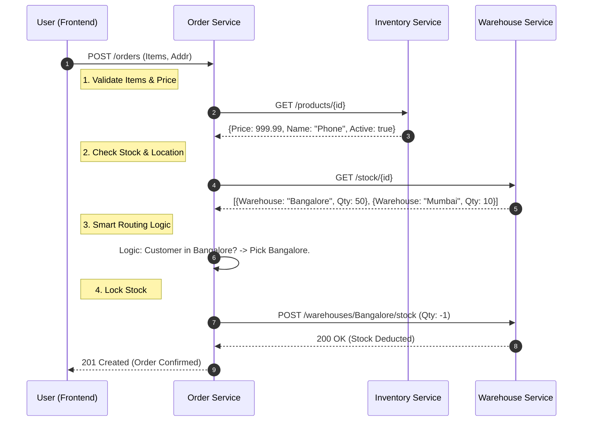

**Tags:** #api #microservices #contracts #smart-fulfillment #documentation **Status:** 🟢 Proposed **Last Updated:** [[2026-02-03]]

---

## 1. Inventory Service 📦

**Role:** The source of truth for Product Metadata (Catalog, Pricing, Descriptions). **Responsibility:** Provides product details to the Frontend and Order Service.

### `GET /products`

Used by the Frontend to render the main shop page.

**Request:**

- **Auth:** Public (or Optional User Token)
    
- **Params:** `page` (default 0), `size` (default 20), `category` (optional filter)
    

**Response `200 OK`:**

```json
{
  "content": [
    {
      "product_id": "a1b2c3d4-e5f6-7890-1234-56789abcdef0",
      "sku": "SMART-PHONE-BLK",
      "name": "Pro Smartphone 15 - Black",
      "description": "512GB Storage, 5G Capable",
      "price": 999.99,
      "category": "ELECTRONICS",
      "image_url": "https://cdn.smartfulfill.com/img/phone-blk.jpg",
      "active": true
    },
    {
      "product_id": "b2c3d4e5-f678-9012-3456-789abcdef012",
      "sku": "WIRELESS-BUDS-WHT",
      "name": "Noise Cancelling Earbuds",
      "description": "Active noise cancellation, 24h battery",
      "price": 199.50,
      "category": "ACCESSORIES",
      "image_url": "https://cdn.smartfulfill.com/img/buds-wht.jpg",
      "active": true
    }
  ],
  "page": 0,
  "size": 20,
  "total_elements": 54
}
```

---

## 2. Order Service 🛒

**Role:** The Transaction Engine (The "Brain"). **Responsibility:** Accepts user intent, validates pricing (via Inventory), checks stock (via Warehouse), and routes the order.

### `POST /orders`

Used when the user clicks "Checkout".

**Request:**

- **Auth:** `Bearer <JWT_TOKEN>` (User context extracted from token)
    

**Payload:**

```json
{
  "shipping_address": {
    "full_name": "Vishnu Dholu",
    "street": "123 Tech Park Avenue",
    "city": "Bengaluru",
    "state": "KA",
    "zip_code": "560100",
    "country": "IN"
  },
  "items": [
    {
      "product_id": "a1b2c3d4-e5f6-7890-1234-56789abcdef0",
      "quantity": 1
    },
    {
      "product_id": "b2c3d4e5-f678-9012-3456-789abcdef012",
      "quantity": 2
    }
  ],
  "payment_method": "CREDIT_CARD"
}
```

**Response `201 Created`:**


```json
{
  "order_id": "order-uuid-5555-6666",
  "status": "CONFIRMED",
  "total_amount": 1398.99,
  "created_at": "2026-02-03T10:30:00Z",
  "fulfillment_details": {
    "warehouse_id": "550e8400-e29b-41d4-a716-446655440000",
    "status": "ALLOCATED"
  }
}
```

---

## 3. Standardized Error Responses ⚠️

Unified error structure for consistent Frontend handling.

### A. Stock Unavailable (`409 Conflict`)

Occurs when `Warehouse Service` reports insufficient quantity.


```json
{
  "timestamp": "2026-02-03T10:35:00Z",
  "status": 409,
  "error": "Conflict",
  "message": "Insufficient inventory for product: Pro Smartphone 15 - Black",
  "path": "/orders",
  "details": {
    "product_id": "a1b2c3d4-e5f6-7890-1234-56789abcdef0",
    "requested_qty": 5,
    "available_qty": 2
  }
}
```

### B. Product Not Found (`404 Not Found`)

Occurs when `product_id` does not exist in `Inventory Service`.


```json
{
  "timestamp": "2026-02-03T10:36:00Z",
  "status": 404,
  "error": "Not Found",
  "message": "Product ID a1b2c3d4... does not exist in the catalog.",
  "path": "/orders"
}
```

### C. Validation Failure (`400 Bad Request`)

Occurs on malformed inputs (negative quantity, missing address).

```json
{
  "timestamp": "2026-02-03T10:37:00Z",
  "status": 400,
  "error": "Bad Request",
  "message": "Validation Failed",
  "validation_errors": {
    "items[0].quantity": "must be greater than 0",
    "shipping_address.zip_code": "must not be blank"
  }
}
```

---

## 4. Smart Order Routing Flow 🧠

How the data moves between services during checkout.

Code snippet


