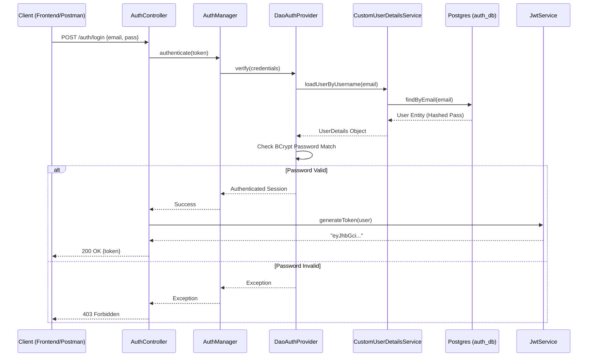

**Service Name:** `auth-service` **Port:** `8081` **Database:** `auth_db` (PostgreSQL / Neon) **Framework:** Spring Boot 4.x / Spring Security 7.x **Authentication Type:** Stateless JWT (JSON Web Token)

---

## 1. Overview

The **Auth Service** is the security gateway for the Smart Order Fulfillment system. It is responsible for:

1. **Identity Management:** Registering new users and storing credentials securely.
    
2. **Authentication:** Verifying user credentials (email/password).
    
3. **Token Issuance:** Generating JWTs that contain user identity and roles (Claims).
    
4. **Authorization:** Providing the "Bridge" between the database users and Spring Security.
    

### System Architecture Flow

This diagram illustrates how a **Login Request** flows through the system components.



## 2. API Endpoints

### 🟢 Register User

Creates a new user account in the database.

- **Endpoint:** `POST /auth/register`
    
- **Access:** Public (`permitAll`)
    

**Request Body:**

JSON

```
{
  "username": "john_doe",
  "email": "john@example.com",
  "password": "securePassword123",
  "role": "CUSTOMER" 
}
```

_Note: Role can be `CUSTOMER`, `ADMIN`, or `WAREHOUSE_MANAGER`._

**Response (200 OK):**

JSON

```
{
  "token": "eyJhbGciOiJIUzI1NiJ9.eyJzdWIiOiJqb2huQGV4YW1wbGUuY29tIiwicm9sZSI6IkNVU1RPTUVSIn0..."
}
```

---

### 🟢 Login User

Authenticates an existing user and returns a fresh JWT.

- **Endpoint:** `POST /auth/login`
    
- **Access:** Public (`permitAll`)
    

**Request Body:**

JSON

```
{
  "email": "john@example.com",
  "password": "securePassword123"
}
```

**Response (200 OK):**

JSON

```
{
  "token": "eyJhbGciOiJIUzI1NiJ9.eyJzdWIiOiJqb2huQGV4YW1wbGUuY29tIiwicm9sZSI6IkNVU1RPTUVSIn0..."
}
```

---

## 3. Core Component Implementation

Details on how the specific classes work, especially regarding the **Spring Security 7** migration.

### A. `SecurityConfig.java` (The Gatekeeper)

This configuration class replaces the old XML-based security.

- **`securityFilterChain`**: Disables CSRF (because we are stateless) and defines public endpoints (`/auth/**`).
    
- **`AuthenticationProvider`**:
    
    - **Critical Detail:** In Spring Boot 4 / Security 7, the `DaoAuthenticationProvider` _must_ be instantiated using the constructor that takes the `UserDetailsService`.
        
    - **Code:** `new DaoAuthenticationProvider(customUserDetailsService)`
        
    - _Why?_ The setters were removed or restricted in newer versions to enforce immutability.
        

### B. `CustomUserDetailsService.java` (The Bridge)

This service acts as a translator between our Database and Spring Security.

- **Interface:** It _must_ `implements UserDetailsService`.
    
- **Function:** `loadUserByUsername(email)`
    
    1. Fetches our custom `User` entity from `UserRepository`.
        
    2. Converts it into a standard `org.springframework.security.core.userdetails.User` object.
        
    3. If not found, throws `UsernameNotFoundException`.
        

### C. `JwtService.java` (The Token Factory)

Handles the math and signing of tokens.

- **Algorithm:** HMAC SHA-256 (`HS256`).
    
- **Claims:** We embed custom data into the token payload:
    
    - `sub`: Email (Standard subject)
        
    - `role`: The user's role (e.g., ADMIN)
        
    - `userId`: The UUID (Useful for other microservices to identify the user).
        
- **Expiration:** Set to 24 hours (`86400000` ms) via `application.properties`.
    

---

## 4. Database Schema

The service connects to the `auth_db` in Neon.

| **Column**      | **Type**  | **Constraints**  | **Description**                                |
| --------------- | --------- | ---------------- | ---------------------------------------------- |
| `user_id`       | UUID      | PK, Auto-gen     | Unique User Identifier                         |
| `username`      | Varchar   | Unique, Not Null | Display name                                   |
| `email`         | Varchar   | Unique, Not Null | Login credential                               |
| `password_hash` | Varchar   | Not Null         | **BCrypt** Encrypted string (never plain text) |
| `role`          | Varchar   | Not Null         | Permission level                               |
| `created_at`    | Timestamp | Auto-gen         | Audit timestamp                                |

---

## 5. Configuration Reference

Key settings in `src/main/resources/application.properties`.
```properties
# Server
server.port=8081
spring.application.name=auth-service

# Database (Neon)
spring.datasource.url=jdbc:postgresql://<REGION_HOST>/auth_db?sslmode=require
spring.datasource.username=auth_admin
spring.jpa.hibernate.ddl-auto=update

# JWT Settings
jwt.secret=<YOUR_256_BIT_SECRET_KEY>
jwt.expiration=86400000
```

---

## 6. Troubleshooting Common Errors

### 🔴 `StackOverflowError` during Login

- **Cause:** `AuthenticationManager` does not have a valid Provider, so it calls itself in an infinite loop.
    
- **Fix:** Ensure `authenticationProvider()` bean is defined in `SecurityConfig` and returns a `DaoAuthenticationProvider`.
    

### 🔴 `Constructor DaoAuthenticationProvider cannot be applied to...`

- **Cause:** Using Spring Security 7 (Boot 4) syntax in an older version, or vice versa.
    
- **Fix:** Use the **constructor injection** method: `new DaoAuthenticationProvider(userDetailsService)`.
    

### 🔴 `403 Forbidden` on `/auth/login`

- **Cause:** The endpoint was not whitelisted in `SecurityConfig`.
    
- **Fix:** Check `.requestMatchers("/auth/**").permitAll()`. Ensure the leading slash `/` is present.