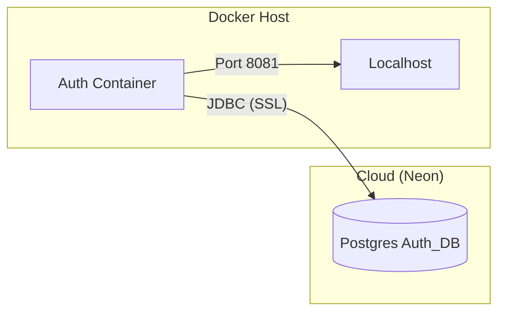

**Project Root:** `smart-fulfillment-system/` **Compose File:** `docker-compose.yml` **Network:** `microservices-net`

## 1. Quick Start

How to spin up the entire backend system locally.

**Start System:**

Bash

```bash
# Builds images and starts containers in the background
docker compose up --build -d
```

**Stop System:**

Bash

```bash
# Stops containers and removes network
docker compose down
```

**View Logs:**

Bash

```bash
# Follow logs for all services
docker compose logs -f

# Follow logs for specific service
docker compose logs -f auth-service
```

---

## 2. Configuration (`.env`)

The system uses a **`.env`** file in the root directory to manage secrets. This file is **ignored by Git** for security.

**Required Variables:**

Properties

```
DB_URL=jdbc:postgresql://<NEON_HOST>/auth_db?sslmode=require
DB_USER=auth_admin
DB_PASS=<PASSWORD>
JWT_SECRET=<256_BIT_SECRET>
GOOGLE_CLIENT_ID=<OAUTH_CLIENT_ID>
```

---

## 3. Architecture

The Docker setup currently consists of the **Auth Service** connected directly to the **Neon Cloud Database**.

Code snippet



---

## 4. Troubleshooting

### 🔴 `Address already in use`

- **Error:** `failed to bind host port 0.0.0.0:8081/tcp`
    
- **Cause:** The local Java application (IntelliJ) is running and blocking the port.
    
- **Fix:** Stop the local app or run `sudo lsof -i :8081` and `kill` the process.
    

### 🔴 `UnknownHostException`

- **Error:** App cannot connect to database.
    
- **Cause:** `docker-compose.yml` is trying to connect to a local container that doesn't exist.
    
- **Fix:** Ensure `SPRING_DATASOURCE_URL` points to the **Neon URL**, not `jdbc:postgresql://auth-db...`.
    

### 🔴 `image not found` or `build failed`

- **Cause:** Docker cannot find the `Dockerfile`.
    
- **Fix:** Ensure `build: ./services/spring/auth` points to the correct folder containing the `pom.xml`.