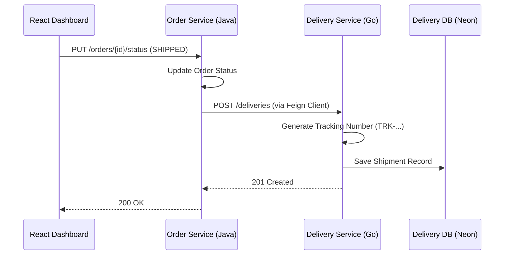

**Tags:** #go #spring-boot #feign-client #microservices #gorm

## 1. Go Delivery Service Initialization

Established the third microservice, written in Go, to handle the post-warehouse logistics lifecycle.

- **Database:** Connects to a dedicated `delivery_db` schema in Neon PostgreSQL. Uses GORM for ORM mapping, strictly binding the Go `Shipment` struct to the existing database schema via `func (Shipment) TableName()`.
    
- **Environment Management:** Integrated `godotenv` to load connection strings from `.env` files during local development, while elegantly falling back to system-level variables for future Kubernetes ConfigMap compatibility.
    
## 2. Cross-Language Orchestration (Java to Go)

Bridged the gap between the Java `Order Service` and the Go `Delivery Service` using synchronous REST communication.

- **Implementation:** Configured a Spring Cloud OpenFeign client (`DeliveryClient`) inside the Java service. The exact millisecond the Warehouse Manager updates an order status to `SHIPPED`, Java automatically constructs a payload and fires it to the Go service port to instantiate the physical tracking ticket.

