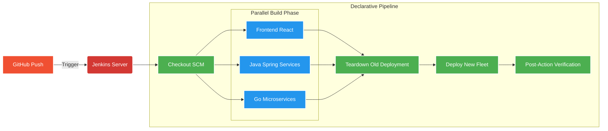

# 🚀 Jenkins CI/CD Pipeline: Smart Order Fulfillment

## 📖 Overview
We successfully transitioned from manual Docker Compose commands to a fully automated Continuous Integration and Continuous Deployment (CI/CD) pipeline using Jenkins. The pipeline pulls code from GitHub, leverages **Parallel Execution** to dramatically reduce build times across our polyglot codebase (React, Java, Go), and deploys the fleet locally.

---

## 🗺️ Pipeline Architecture Diagram




## Workflow Breakdown

1. **SCM Checkout:** Jenkins automatically clones the latest `main` branch from the GitHub repository.
    
2. **Parallel Fleet Build (`failFast true`):**
    
    - **Frontend:** Builds the React/Vite SPA and packages it into an Nginx container.
        
    - **Java Core:** Compiles the Spring Boot services (`auth-service`, `inventory-service`, `order-service`) using the Maven multi-stage Dockerfile.
        
    - **Go Fleet:** Compiles the Go binaries (`warehouse`, `delivery`, `notification`) via multi-stage Alpine Dockerfiles.
        
    - _Note:_ Because these run in parallel, if one fails, the `failFast` directive immediately stops the others to save resources.
        
3. **Automated Teardown:** Executes `docker compose down` to gracefully stop and remove the old running containers and network. This prevents "name collision" errors during deployment.
    
4. **Automated Deployment:** Executes `docker compose up -d` to spin up the freshly built images on the `microservices-net` bridge network.
    
5. **Post-Action Verification:** Runs `docker compose ps` to print the active state of the newly deployed fleet directly into the Jenkins console logs for immediate visibility.
    

---

## 💡 Key Architectural Fixes Applied

During implementation, a critical DevOps pattern was established to prevent deployment crashes:

- **Removed Hardcoded Container Names:** Hardcoded `container_name` attributes were stripped from the `docker-compose.yml`. This allows Docker to dynamically assign names, preventing fatal `Conflict. The container name is already in use` errors when Jenkins attempts to build or deploy while an older instance is still hanging.
    
- **Idempotent Deployments:** The addition of the explicit teardown step (`docker compose down`) right before the deployment step guarantees that every pipeline run starts with a completely clean slate.

---

## The Final `Jenkinsfile`

This declarative script sits at the root of the repository and dictates the automation:

```groovy
pipeline {
    // Run on any available Jenkins agent
    agent any

    // Keep the Jenkins server clean by only saving the last 5 build logs
    options {
        buildDiscarder(logRotator(numToKeepStr: '5'))
        disableConcurrentBuilds()
    }

    stages {
        stage('📥 Checkout Code') {
            steps {
                checkout scm
            }
        }

        // Build the images in parallel to save massive amounts of time
        stage('🏗️ Build Polyglot Fleet') {
            failFast true
            parallel {
                stage('⚛️ Frontend (Node/Vite)') {
                    steps {
                        echo "Building React Application..."
                        sh 'docker compose build frontend'
                    }
                }
                
                stage('☕ Java Core (Maven)') {
                    steps {
                        echo "Building Spring Boot Services..."
                        sh 'docker compose build auth-service inventory-service order-service'
                    }
                }
                
                stage('🐹 Go Fleet (Gin)') {
                    steps {
                        echo "Building Go Microservices..."
                        sh 'docker compose build warehouse-service delivery-service notification-service'
                    }
                }
            }
        }

        stage('🚀 Deploy to Local Server') {
            steps {
                echo "Deploying the freshly built containers..."
                // Teardown the old pipeline containers first to prevent conflicts
                sh 'docker compose down'
                // Spin up the fresh ones
                sh 'docker compose up -d'
            }
        }
    }
    
    post {
        always {
            // Print out the running containers so you can see the status in the Jenkins UI
            sh 'docker compose ps'
        }
        failure {
            echo "❌ Pipeline failed! Check the logs above."
        }
        success {
            echo "✅ Pipeline completed successfully! The Smart Order fleet is running."
        }
    }
}
```
