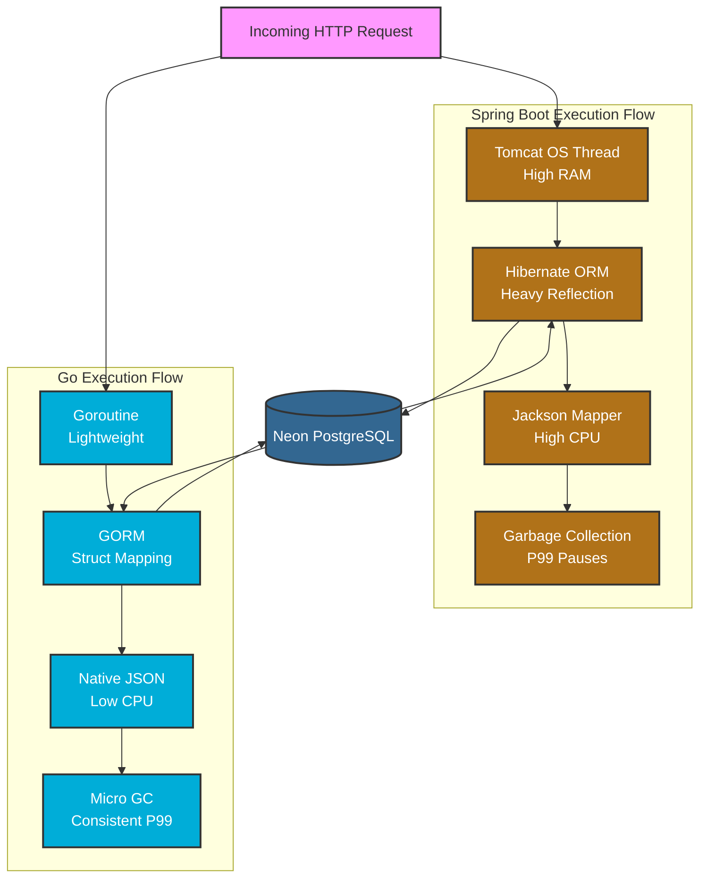

##  Experiment Overview
This report presents a comparative performance analysis between a JIT-compiled runtime (Java 21 / Spring Boot 3) and an AOT-compiled statically-linked runtime (Go 1.25 / Gin). The analysis isolates specific variables to measure web framework overhead, garbage collection footprints, and database serialization efficiency.

---

##  Phase 1: Infrastructure Baseline (Resting State)
Before introducing load, the idle resource consumption of the containerized services was measured to establish the baseline architectural overhead.

* **Java (Spring Boot) Idle Memory:** ~294 MB
* **Go (Gin) Idle Memory:** ~4 MB

**SSP Observation:** The JVM requires significant upfront memory allocation to manage the Java Heap, the Garbage Collector (GC), and the expansive Spring Application Context. The Go binary, compiled natively, incurs near-zero overhead, making it exceptionally resource-efficient for high-density microservice deployments.

---

##  Phase 2: Scenario A - Framework Overhead (Zero DB I/O)
**Objective:** Measure raw compute and framework routing speed by targeting endpoints that return static strings (`/ping` and `/health`), eliminating database and network latency from the equation.

###  Metrics Captured
| Metric | Java (Spring Boot) | Go (Gin) |
| :--- | :--- | :--- |
| **Max Throughput** | ~1,400 RPS (Combined) | ~1,400 RPS (Combined) |
| **Median Latency** | 42 ms | 42 ms |
| **P99 Latency** | 230 ms | 120 ms |
| **Error Rate** | 0% | 0% |

###  Performance Analysis
1.  **Parity at the Median:** Once the Java Just-In-Time (JIT) compiler identifies hot paths and optimizes the bytecode into native machine code, Spring Boot matches the median latency of the pre-compiled Go binary.
2.  **The GC Footprint (P99 Spike):** The critical difference lies in the 99th percentile. Java's P99 latency is nearly double that of Go's. This is the measurable impact of **JVM Garbage Collection pauses**. As Tomcat rapidly creates and destroys request objects, the GC must periodically halt execution to reclaim memory. Go's runtime is aggressively optimized for low-latency GC, resulting in a much tighter latency spread.

---

## Phase 3: Scenario B - I/O & Serialization (Database Reads)
**Objective:** Measure system performance under real-world constraints by fetching relational data from a Neon PostgreSQL database and serializing it into JSON arrays (`/products` and `/warehouses`).

### Metrics Captured
| Metric | Java (Hibernate/Jackson) | Go (GORM/Native) |
| :--- | :--- | :--- |
| **Max Throughput** | ~60 RPS (System Bottleneck) | ~60 RPS (System Bottleneck) |
| **Median Latency** | 3,300 ms | 74 ms |
| **P99 Latency** | ~5,500 ms | ~140 ms |
| **Error Rate** | 0% | 0% |

###  Performance Analysis
1.  **The I/O Bottleneck:** Throughput dropped from 1,400 RPS to 60 RPS. The system is no longer CPU-bound; it is completely constrained by network I/O and database connection pooling limits.
2.  **Serialization Efficiency:** Under heavy concurrent load, the Go service resolves database queries and serializes the JSON payload in a staggering **74ms**. The Java service struggles, requiring over **3.3 seconds** on average. 
3.  **Root Cause:** This highlights the heavyweight nature of Java's Reflection API used by Hibernate (ORM) and Jackson (JSON mapper). Constructing deep object graphs and serializing them under concurrent thread contention creates massive bottlenecks compared to Go's lightweight struct mapping and goroutine multiplexer.

---

##  Architectural Lifecycle Comparison Diagram

