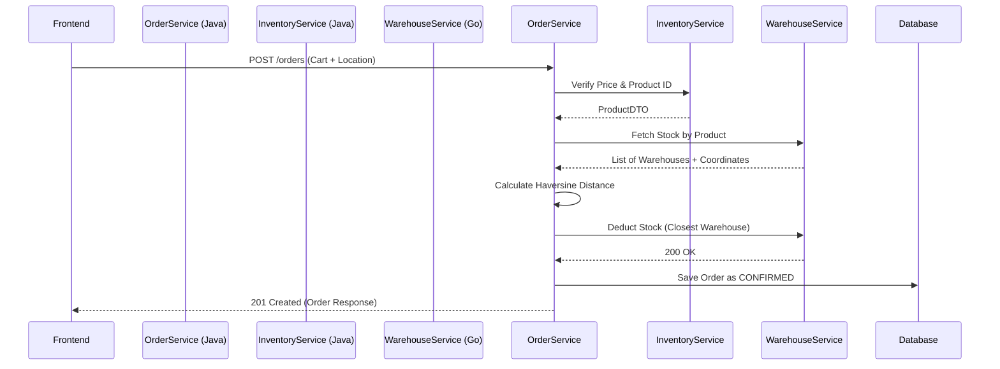

**Tags:** #java #spring-boot #feign-client #geospatial #microservices

## 1. Microservice Orchestration (`OrderService.java`)

The Order Service acts as the central orchestrator for a customer purchase, coordinating between three separate databases.

## 2. Geospatial Warehouse Allocation (The Haversine Formula)

Instead of arbitrary deduction, the system dynamically routes orders to the closest physical facility to optimize delivery speed.

- **Logic:** Streams the list of warehouses containing the requested SKU, filters out any with insufficient quantity, and uses `LocationUtils.calculateDistance` to find the minimum distance between the customer's coordinates and the warehouse's coordinates.
    
- **Fallback Safety:** If latitude/longitude are missing from the request, it safely defaults to `0.0` to prevent `NullPointerExceptions` during the stream operation.

