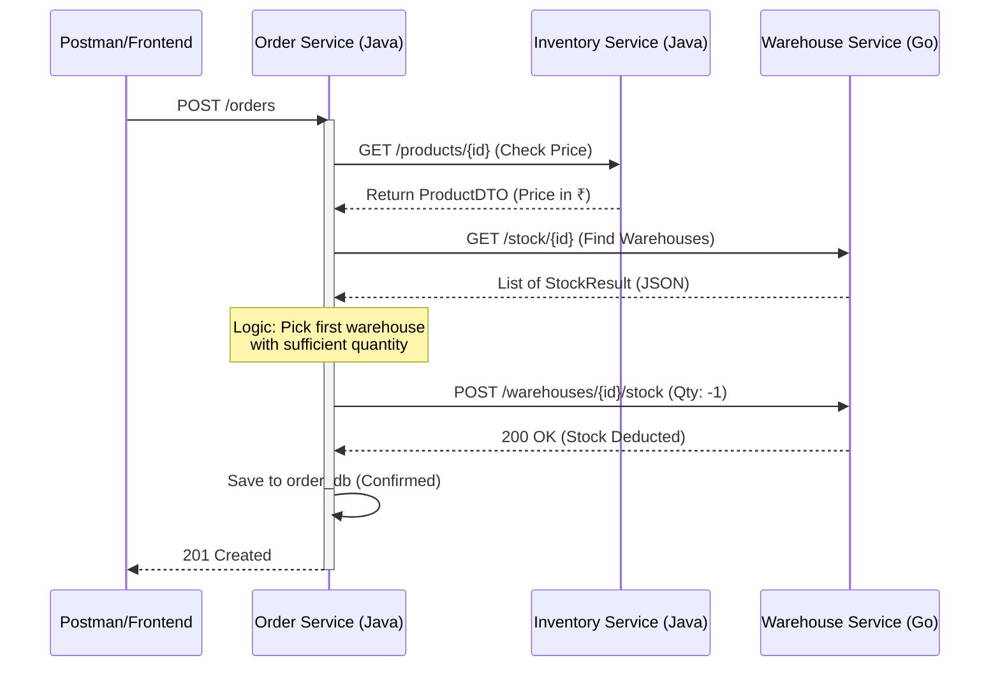

**Tags:** #microservices #springboot #golang #distributed-systems #obsidian-notes **Date:** [[2026-02-15]]

---

## 🛰️ Architecture Overview

The system uses a **decentralized data pattern** where each service owns its own database. Communication is handled via **Synchronous REST** using Spring Cloud OpenFeign.

|**Service**|**Language**|**Port**|**Database**|**Role**|
|---|---|---|---|---|
|**Auth**|Java/Spring|`8081`|`auth_db`|Identity & JWT|
|**Inventory**|Java/Spring|`8082`|`inventory_db`|Product Catalog & Pricing|
|**Order**|Java/Spring|`8083`|`order_db`|Orchestrator (The Brain)|
|**Warehouse**|Go/Gin|`8084`|`warehouse_db`|Physical Stock & Location|

---

## 🔄 The "Golden Path" Order Flow

When a user places an order, a **Distributed Transaction** occurs across three services.

### Detailed Step-by-Step Implementation

#### 1. Order Initiation (`Order Service`)

The `OrderController` receives a `POST /orders` request. It extracts the `userId` from the `X-User-Id` header (simulating a Gateway pass-through).

#### 2. Price Validation (`Inventory Service`)

The Order Service uses **OpenFeign** to call the Inventory Service.

- **Security Check:** We do not trust the price sent by the frontend. We fetch the source-of-truth price from the database to calculate the `total_amount`.
    

#### 3. Stock Allocation (`Warehouse Service`)

This is the "Smart" part of the system.

- **Find Stock:** Order Service calls Go-based Warehouse Service `GET /stock/{productId}`.
    
- **Strategy:** It receives a list of warehouses. Currently, it uses a **First-Fit** strategy (picking the first warehouse with enough quantity).
    
- **Deduction:** It sends a `POST` request to the specific warehouse to deduct stock (`quantity: -1`).
    

#### 4. Persistence

If all external calls succeed, the Order Service saves the order and items to `order_db` with a `CONFIRMED` status. Because of the `@Transactional` annotation, if any step fails, the local database write is rolled back.

---

## 🛠️ Critical Implementation Logic (Code Snippets)

### A. The "Smart" Allocator (Java)

```java
// Logic inside OrderService.java
private void allocateStock(List<OrderItem> items) {
    for (OrderItem item : items) {
        // Find which Go-managed warehouses have stock
        List<StockDTO> warehouses = warehouseClient.getStockByProduct(item.getProductId());
        
        boolean success = warehouses.stream()
            .filter(wh -> wh.getQuantity() >= item.getQuantity())
            .findFirst()
            .map(wh -> deductFromGo(wh, item))
            .orElse(false);

        if (!success) throw new RuntimeException("Insufficient Global Stock");
    }
}
```

### B. Atomic Stock Update (Go)

```go
// Logic inside handlers.UpdateStock (Go)
err = database.DB.Transaction(func(tx *gorm.DB) error {
    // 1. Find the stock record
    // 2. Calculate: current_qty + requested_change (e.g. 10 + -1)
    // 3. Prevent negative stock
    if newQuantity < 0 { return gorm.ErrInvalidData }
    return tx.Save(&stock).Error
})
```

## ⚠️ Known Issues & Solutions Recap

> [!IMPORTANT] Database Ownership **Issue:** `SQLSTATE 42501 (Permission Denied)`. **Cause:** Tables created by Neon Superuser, but App connects as `order_admin`. **Fix:** `ALTER TABLE orders OWNER TO order_admin;`

> [!WARNING] JSON Contract **Issue:** Java received `null` IDs from Go. **Fix:** Use `@JsonProperty("warehouse_id")` in Java DTOs to match Go’s `snake_case` JSON output.



