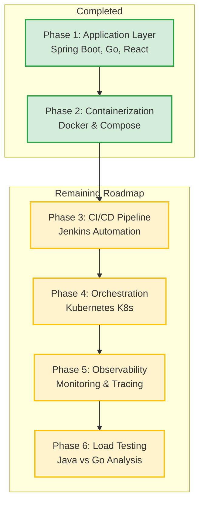

```mermaid
flowchart TD
    subgraph Completed
    P1[Phase 1: Application Layer<br/>Spring Boot, Go, React]
    P2[Phase 2: Containerization<br/>Docker & Compose]
    end
    
    subgraph Remaining Roadmap
    P3[Phase 3: CI/CD Pipeline<br/>Jenkins Automation]
    P4[Phase 4: Orchestration<br/>Kubernetes K8s]
    P5[Phase 5: Observability<br/>Monitoring & Tracing]
    P6[Phase 6: Load Testing<br/>Java vs Go Analysis]
    end
    
    P1 --> P2
    P2 --> P3
    P3 --> P4
    P4 --> P5
    P5 --> P6
    
    style P1 fill:#d4edda,stroke:#28a745,stroke-width:2px
    style P2 fill:#d4edda,stroke:#28a745,stroke-width:2px
    style P3 fill:#fff3cd,stroke:#ffc107,stroke-width:2px
    style P4 fill:#fff3cd,stroke:#ffc107,stroke-width:2px
    style P5 fill:#fff3cd,stroke:#ffc107,stroke-width:2px
    style P6 fill:#fff3cd,stroke:#ffc107,stroke-width:2px
```
