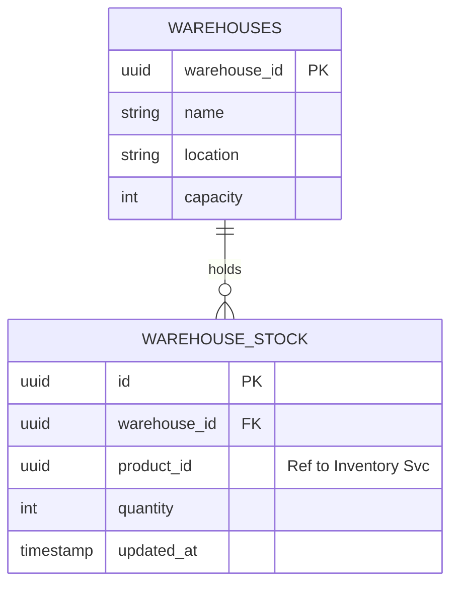
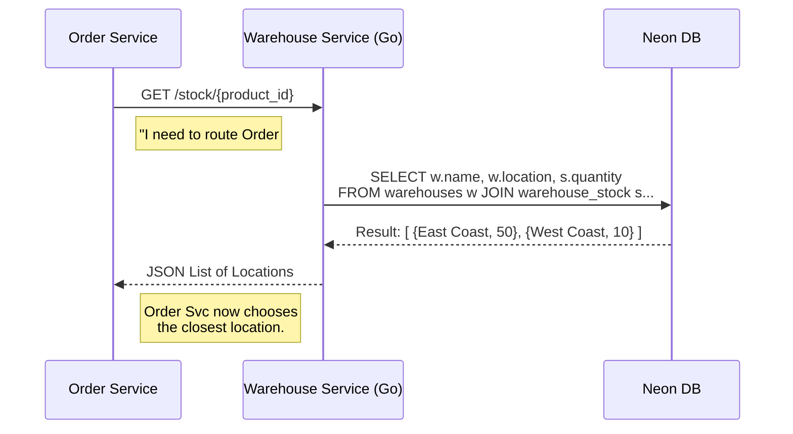

**Language:** Go (Golang) 1.22 **Framework:** Gin (Web), GORM (ORM) **Database:** PostgreSQL (Neon) **Port:** `8084`

---

## 1. Overview

The Warehouse Service is a high-performance microservice designed to manage the physical fulfillment network. It tracks **where** items are stored and allows the **Order Service** to intelligently route orders to the nearest facility.

### **Key Responsibilities**

1. **Network Management:** Registering new physical warehouses.
    
2. **Inventory Tracking:** Handling inbound stock updates (Add/Remove items).
    
3. **Smart Allocation:** Providing a real-time list of warehouses that hold a specific product.
    

---

## 2. Architecture & Flow

### **Data Model**

The service uses a relational model separating the "Place" (Warehouse) from the "Item" (Stock).



---

### **Smart Query Logic**

When the Order Service asks "Who has Product X?", the Warehouse Service executes an optimized join:



---

## 3. API Reference

### 🔵 Create Warehouse

**POST** `/warehouses`

```json
{
  "name": "Seattle Fulfillment Center",
  "location": "Seattle, WA",
  "capacity": 20000
}
```

### 🟢 Update Stock (Inbound)

**POST** `/warehouses/:id/stock`


```json
{
  "product_id": "a1b2c3d4-...",
  "quantity": 50
}
```

### 🟣 Check Availability (Smart Query)

**GET** `/stock/:product_id` **Response:**


```json
[
  {
    "warehouse_id": "550e8400-...",
    "warehouse_name": "Seattle Fulfillment Center",
    "location": "Seattle, WA",
    "quantity": 50
  }
]
```