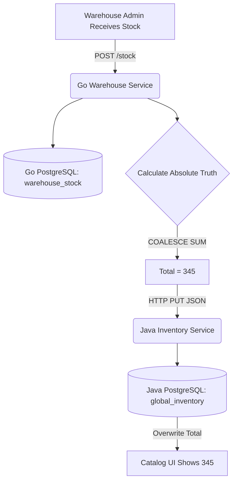

**Tags:** #architecture #system-design #data-integrity #idempotency

## 1. The Data Drift Problem

In a "Database-per-Service" polyglot architecture, local state and global state can easily fall out of sync (Data Drift).

- **The Scenario:** Physical inventory is received and logged in the Go `Warehouse Service` (local truth). However, the Java `Inventory Service` (global catalog truth) remains unaware, resulting in a Catalog UI that displays `0` available stock despite physical items sitting on warehouse shelves.

## 2. The Idempotent Sync Solution

Implemented a cross-service synchronization mechanism that relies on **absolute state** rather than delta updates, ensuring maximum data integrity.

