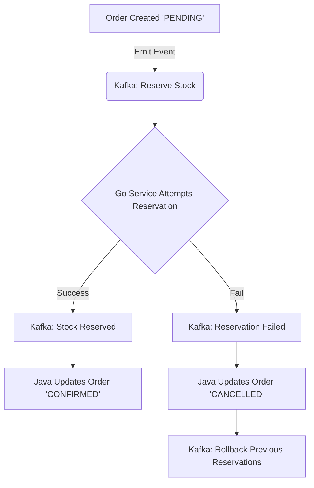

**Tags:** #architecture #system-design #transactions

## The Limitation of `@Transactional`

In a monolithic application, `@Transactional` wraps all database operations in a single commit/rollback block. In our microservices architecture, the `OrderService` (Java) makes an HTTP call to deduct stock in the `WarehouseService` (Go).

- **The Bug:** If an order has two items, and Item A successfully deducts from Go, but Item B throws an error in Java, Spring Boot rolls back the Java Order. However, Go _does not know_ this happened, resulting in permanently "ghosted" inventory missing from the warehouse.
    

## The Industry Solution: Saga Pattern

To make this system enterprise-grade, the synchronous HTTP call should be replaced with an Event-Driven Saga Pattern using a message broker like RabbitMQ or Kafka.

- _Note for SPE/SSP Defense:_ This design paradigm prevents locking the database across network boundaries, preserving high availability and data integrity in distributed architectures.