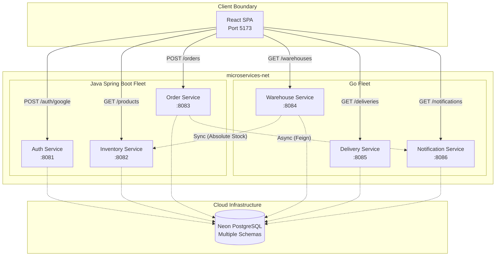
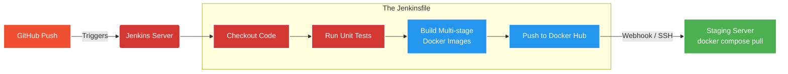

---
tags:
  - architecture
  - microservices
  - spring-boot
  - golang
  - react
  - devops
  - docker
date: 2026-03-18
author: Vishnu
---
---
tags:
  - architecture
  - microservices
  - spring-boot
  - golang
  - react
  - devops
  - docker
date: 2026-03-18
author: Vishnu
---

# 🏗️ Smart Order Fulfillment System (Direct Routing Architecture)

## 📖 Overview
The Smart Order Fulfillment System is a polyglot microservices architecture designed to handle e-commerce operations. The system is split into a React frontend, a Java (Spring Boot) core fleet, and a Go peripheral fleet. Currently, it utilizes a decentralized routing model where the frontend communicates directly with individual microservices, and each service manages its own cross-origin (CORS) security.

---

## 🗺️ Architecture Diagram

---
## 🧩 System Components

### 1. Frontend Layer

- **Tech Stack:** React, Vite, Nginx.
    
- **Deployment:** Multi-stage Docker build. Vite compiles static assets (`dist`), which are served by Nginx.
    
- **Routing Strategy:** Uses an `nginx.conf` with `try_files $uri $uri/ /index.html;` to allow React Router to handle client-side navigation without throwing 404s on page refresh.
    
- **Environment Configuration:** The `.env` file explicitly maps out the direct URL for every backend service (e.g., `VITE_AUTH_SERVICE_URL=http://localhost:8081`).
    

### 2. Java Fleet (Spring Boot)

- **Tech Stack:** Java 21, Spring Boot 4.0.3, Spring Security, Hibernate/JPA.
    
- **CORS Handling:** Managed explicitly within each service via `@Configuration` classes implementing `WebMvcConfigurer` (or `SecurityFilterChain` for Auth).
    
- **Services:**
    
    - `auth-service`: Manages user registration and Google OAuth 2.0 logins. Issues stateless system JWTs.
        
    - `inventory-service`: Manages product catalog and SKU details.
        
    - `order-service`: Orchestrates the checkout process. Triggers cross-service events.
        

### 3. Go Fleet

- **Tech Stack:** Go 1.25, Gin Framework.
    
- **Services:**
    
    - `warehouse-service`: Tracks absolute stock and syncs with the Java inventory.
        
    - `delivery-service`: Tracks shipment status and routes.
        
    - `notification-service`: Dispatches SMTP emails and system alerts.
        

### 4. Data Layer

- **Tech Stack:** Neon PostgreSQL (Serverless Cloud DB).
    
- **Design:** Database-per-service pattern. Services connect directly to their respective logical databases via HikariCP connection pooling.
    

---

## 🔐 Authentication Workflow (Google OAuth)

The system utilizes a custom Google Identity Services (GSI) implementation to securely map Google users to internal system accounts.

1. **Client Request:** User clicks Google Sign-In. Vite allows the popup via relaxed `Cross-Origin-Opener-Policy` headers.
    
2. **Token Generation:** Google authenticates and returns a credential token to the React app.
    
3. **CORS Handshake:** React sends an `OPTIONS` preflight request directly to `http://localhost:8081/auth/google`. The `auth-service` Spring Security configuration permits the preflight and attaches the allowed origins.
    
4. **Backend Verification:** React sends the `POST` request with the token. The `auth-service` validates the token, maps the user, and issues an internal JWT for subsequent requests.
    

---

## 🛠️ DevOps & Containerization

- **Orchestration:** Docker Compose (`docker-compose.yml`).
    
- **Networking:** All backend services communicate over a custom bridge network (`microservices-net`) using container names as DNS records. Ports are explicitly mapped to the host machine for direct frontend access.
    
- **Build Strategy:** Multi-stage Dockerfiles for all services to optimize image size and security.
    
    - _Java:_ Uses Maven builder stage -> copies `*.jar` -> Alpine JRE image.
        
    - _Go:_ Compiles a static binary (`CGO_ENABLED=0`) -> scratch Alpine image.
        
    - _React:_ Uses Node builder stage -> static `dist` files -> Nginx image.

