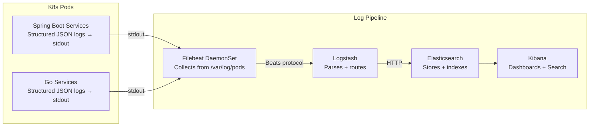

# ELK Stack Integration Plan
## Smart Order Fulfillment System

### Overview
Integrate Elasticsearch + Logstash + Kibana (ELK) with Filebeat as the log shipper. Every pod's stdout/stderr logs will be collected by a Filebeat DaemonSet, enriched with Kubernetes metadata, parsed by Logstash, stored in Elasticsearch, and visualized in Kibana.



---

## Proposed Changes

### Component 1 — Kubernetes ELK Deployment

#### [NEW] `k8s/elk/elasticsearch.yaml`
Deploy a single-node Elasticsearch instance in the `smart-order` namespace.

```yaml
apiVersion: apps/v1
kind: StatefulSet
metadata:
  name: elasticsearch
  namespace: smart-order
spec:
  serviceName: elasticsearch
  replicas: 1
  selector:
    matchLabels: { app: elasticsearch }
  template:
    metadata:
      labels: { app: elasticsearch }
    spec:
      containers:
        - name: elasticsearch
          image: docker.elastic.co/elasticsearch/elasticsearch:8.13.0
          resources:
            requests: { memory: "1Gi", cpu: "500m" }
            limits:   { memory: "2Gi", cpu: "1000m" }
          env:
            - { name: discovery.type, value: single-node }
            - { name: xpack.security.enabled, value: "false" }  # dev mode
            - { name: ES_JAVA_OPTS, value: "-Xms512m -Xmx512m" }
          ports:
            - { containerPort: 9200 }
          volumeMounts:
            - { name: es-data, mountPath: /usr/share/elasticsearch/data }
  volumeClaimTemplates:
    - metadata: { name: es-data }
      spec:
        accessModes: [ReadWriteOnce]
        resources:
          requests: { storage: 5Gi }
---
apiVersion: v1
kind: Service
metadata:
  name: elasticsearch
  namespace: smart-order
spec:
  selector: { app: elasticsearch }
  ports:
    - { port: 9200, targetPort: 9200 }
```

#### [NEW] `k8s/elk/logstash.yaml`
Logstash pipeline reads from Filebeat, parses JSON logs, and writes to Elasticsearch.

```yaml
apiVersion: v1
kind: ConfigMap
metadata:
  name: logstash-config
  namespace: smart-order
data:
  logstash.conf: |
    input {
      beats { port => 5044 }
    }
    filter {
      if [message] =~ /^\{/ {
        json { source => "message" target => "parsed" }
        mutate { add_field => { "log_level" => "%{[parsed][level]}"
                               "service"    => "%{[parsed][service]}"
                               "trace_id"   => "%{[parsed][trace_id]}" } }
      }
      mutate {
        add_field => { "environment" => "k8s" }
      }
    }
    output {
      elasticsearch {
        hosts    => ["http://elasticsearch:9200"]
        index    => "smartorder-logs-%{+YYYY.MM.dd}"
      }
    }
---
apiVersion: apps/v1
kind: Deployment
metadata:
  name: logstash
  namespace: smart-order
spec:
  replicas: 1
  selector: { matchLabels: { app: logstash } }
  template:
    metadata: { labels: { app: logstash } }
    spec:
      containers:
        - name: logstash
          image: docker.elastic.co/logstash/logstash:8.13.0
          resources:
            requests: { memory: "512Mi", cpu: "250m" }
            limits:   { memory: "1Gi",   cpu: "500m" }
          ports:
            - { containerPort: 5044 }
          volumeMounts:
            - { name: config, mountPath: /usr/share/logstash/pipeline }
      volumes:
        - name: config
          configMap: { name: logstash-config }
---
apiVersion: v1
kind: Service
metadata:
  name: logstash
  namespace: smart-order
spec:
  selector: { app: logstash }
  ports:
    - { port: 5044, targetPort: 5044 }
```

#### [NEW] `k8s/elk/kibana.yaml`
```yaml
apiVersion: apps/v1
kind: Deployment
metadata:
  name: kibana
  namespace: smart-order
spec:
  replicas: 1
  selector: { matchLabels: { app: kibana } }
  template:
    metadata: { labels: { app: kibana } }
    spec:
      containers:
        - name: kibana
          image: docker.elastic.co/kibana/kibana:8.13.0
          resources:
            requests: { memory: "512Mi", cpu: "250m" }
            limits:   { memory: "1Gi",   cpu: "500m" }
          env:
            - { name: ELASTICSEARCH_HOSTS, value: "http://elasticsearch:9200" }
          ports:
            - { containerPort: 5601 }
---
apiVersion: v1
kind: Service
metadata:
  name: kibana
  namespace: smart-order
spec:
  selector: { app: kibana }
  type: NodePort
  ports:
    - { port: 5601, targetPort: 5601, nodePort: 30601 }
```

#### [NEW] `k8s/elk/filebeat.yaml`
DaemonSet runs one Filebeat pod per Node, collecting all pod logs.

```yaml
apiVersion: v1
kind: ConfigMap
metadata:
  name: filebeat-config
  namespace: smart-order
data:
  filebeat.yml: |
    filebeat.inputs:
      - type: container
        paths:
          - /var/log/pods/smart-order_*/*/*.log   # only smart-order namespace
        processors:
          - add_kubernetes_metadata:
              host: ${NODE_NAME}
              matchers:
                - logs_path:
                    logs_path: "/var/log/pods/"

    output.logstash:
      hosts: ["logstash:5044"]
---
apiVersion: apps/v1
kind: DaemonSet
metadata:
  name: filebeat
  namespace: smart-order
spec:
  selector: { matchLabels: { app: filebeat } }
  template:
    metadata: { labels: { app: filebeat } }
    spec:
      serviceAccountName: filebeat
      containers:
        - name: filebeat
          image: docker.elastic.co/beats/filebeat:8.13.0
          args: ["-c", "/etc/filebeat.yml", "-e"]
          env:
            - { name: NODE_NAME, valueFrom: { fieldRef: { fieldPath: spec.nodeName } } }
          resources:
            limits:   { memory: "200Mi", cpu: "100m" }
            requests: { memory: "100Mi", cpu: "50m" }
          volumeMounts:
            - { name: config,    mountPath: /etc/filebeat.yml, subPath: filebeat.yml }
            - { name: varlogs,   mountPath: /var/log/pods,     readOnly: true }
            - { name: varlogcon, mountPath: /var/lib/docker/containers, readOnly: true }
      volumes:
        - name: config
          configMap: { name: filebeat-config }
        - name: varlogs
          hostPath: { path: /var/log/pods }
        - name: varlogcon
          hostPath: { path: /var/lib/docker/containers }
---
# RBAC for Filebeat to discover pod metadata
apiVersion: v1
kind: ServiceAccount
metadata: { name: filebeat, namespace: smart-order }
---
apiVersion: rbac.authorization.k8s.io/v1
kind: ClusterRole
metadata: { name: filebeat }
rules:
  - apiGroups: [""] 
    resources: [namespaces, pods, nodes]
    verbs: [get, list, watch]
---
apiVersion: rbac.authorization.k8s.io/v1
kind: ClusterRoleBinding
metadata: { name: filebeat }
subjects:
  - { kind: ServiceAccount, name: filebeat, namespace: smart-order }
roleRef:
  kind: ClusterRole
  name: filebeat
  apiGroup: rbac.authorization.k8s.io
```

---

### Component 2 — Spring Boot Services (Structured JSON Logging)

All 4 Spring Boot services need the same change: replace default Logback with a JSON encoder that writes structured logs to stdout.

#### [MODIFY] Each Spring Boot service `pom.xml`
Add the Logstash Logback encoder:
```xml
<dependency>
    <groupId>net.logstash.logback</groupId>
    <artifactId>logstash-logback-encoder</artifactId>
    <version>7.4</version>
</dependency>
```

#### [NEW] `src/main/resources/logback-spring.xml` (same for all 4 Spring services)
```xml
<configuration>
  <appender name="JSON_STDOUT" class="ch.qos.logback.core.ConsoleAppender">
    <encoder class="net.logstash.logback.encoder.LogstashEncoder">
      <customFields>{"service":"${spring.application.name}"}</customFields>
    </encoder>
  </appender>

  <root level="INFO">
    <appender-ref ref="JSON_STDOUT" />
  </root>
</configuration>
```

This produces logs like:
```json
{
  "timestamp": "2026-05-13T16:47:00.000Z",
  "level": "INFO",
  "service": "api-gateway",
  "message": "POST /api/warehouse/warehouses → 201",
  "logger": "c.s.api_gateway.filter.JwtHeaderEnrichmentFilter",
  "thread": "reactor-http-nio-3"
}
```

#### [MODIFY] `api-gateway/src/main/java/.../filter/JwtHeaderEnrichmentFilter.java`
Add structured MDC logging for request tracing:
```java
MDC.put("trace_id", UUID.randomUUID().toString().substring(0, 8));
MDC.put("user_role", userRole);
MDC.put("user_id", userId);
log.info("Forwarding request: {} {} as role={}", method, path, userRole);
```

---

### Component 3 — Go Services (Structured JSON Logging)

#### [MODIFY] Each Go service `go.mod`
Add zerolog:
```
require github.com/rs/zerolog v1.32.0
```

#### [MODIFY] `warehouse-service/cmd/main.go`
Replace `log.Printf` with zerolog structured logger:
```go
import "github.com/rs/zerolog/log"

// Init once at startup:
zerolog.TimeFieldFormat = zerolog.TimeFormatUnix
log.Logger = log.With().Str("service", "warehouse-service").Logger()

// Usage in handlers:
log.Info().
    Str("trace_id", traceID).
    Str("warehouse_id", warehouseID).
    Int("quantity", quantity).
    Msg("Stock updated")

log.Error().
    Err(err).
    Str("inventory_url", inventoryURL).
    Msg("Failed to sync global stock to inventory service")
```

This produces:
```json
{
  "level": "info",
  "service": "warehouse-service",
  "trace_id": "a3f9b2c1",
  "warehouse_id": "uuid-here",
  "quantity": 500,
  "message": "Stock updated",
  "time": 1715619820
}
```

---

### Component 4 — Kibana Dashboards (Manual Setup Post-Deploy)

After deployment, configure these in Kibana UI:

| Dashboard | Query | Purpose |
|-----------|-------|---------|
| **Error Rate** | `level: ERROR` | Spike detection across all services |
| **Stock Sync Failures** | `message: "Failed to sync"` | Warehouse → Inventory sync issues |
| **4xx/5xx per Service** | `message: *403* OR *500*` | RBAC and server errors by service |
| **Slow Requests** | `duration_ms > 2000` | Latency hotspots |
| **Auth Failures** | `service: auth-service AND level: WARN` | Login/JWT issues |

---

### Component 5 — Ingress Route for Kibana

#### [MODIFY] `k8s/ingress.yaml`
Add Kibana path to the existing ingress:
```yaml
- path: /kibana
  pathType: Prefix
  backend:
    service:
      name: kibana
      port:
        number: 5601
```

Or access directly via NodePort: `http://$(minikube ip):30601`

---

## Deployment Order

```bash
# 1. Deploy Elasticsearch first (needs time to start)
kubectl apply -f k8s/elk/elasticsearch.yaml

# 2. Wait for it to be ready
kubectl rollout status statefulset/elasticsearch -n smart-order

# 3. Deploy Logstash
kubectl apply -f k8s/elk/logstash.yaml

# 4. Deploy Kibana
kubectl apply -f k8s/elk/kibana.yaml

# 5. Deploy Filebeat DaemonSet (starts collecting immediately)
kubectl apply -f k8s/elk/filebeat.yaml

# 6. Rebuild Spring Boot images with logstash-logback-encoder added
# Rebuild Go images with zerolog added
# Then re-run the Jenkins pipeline

# 7. Access Kibana
minikube service kibana -n smart-order
# OR
kubectl port-forward svc/kibana 5601:5601 -n smart-order
```

---

## Resource Requirements

| Component | CPU Request | Memory Request | Notes |
|-----------|-------------|----------------|-------|
| Elasticsearch | 500m | 1Gi | Minimum for single-node |
| Logstash | 250m | 512Mi | |
| Kibana | 250m | 512Mi | |
| Filebeat (per node) | 50m | 100Mi | DaemonSet — 1 per node |
| **Total added** | **~1100m** | **~2.2Gi** | |

> [!IMPORTANT]
> Minikube needs at least **4 CPUs and 6GB RAM** for ELK + all existing services. Run:
> `minikube start --cpus=4 --memory=6144`

---

## Open Questions

> [!IMPORTANT]
> **1. Security for Kibana?**
> The plan sets `xpack.security.enabled: false` for simplicity (dev mode). For production, enable X-Pack security with username/password. Should this be enabled now?

> [!IMPORTANT]
> **2. Log retention?**
> Elasticsearch indices will grow indefinitely. Should we add ILM (Index Lifecycle Management) to auto-delete logs older than N days (e.g. 7 days for dev, 30 for prod)?

> [!NOTE]
> **3. Trace ID correlation?**
> For full distributed tracing, we can add a `X-Trace-ID` header propagated by the API Gateway through to all services (Spring + Go). This enables filtering all logs for a single request across services. Worth adding in the same pass?

> [!NOTE]
> **4. APM vs ELK-only?**
> Elastic APM Agent can be added to Spring Boot services for full request traces (not just logs). It's heavier but gives latency breakdowns per endpoint. Do you want APM included?
