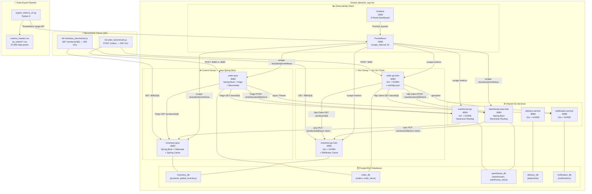
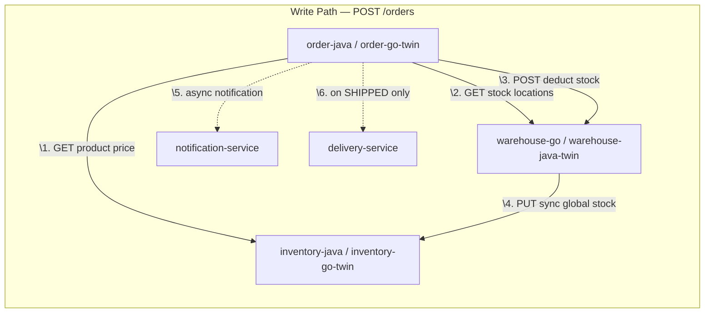
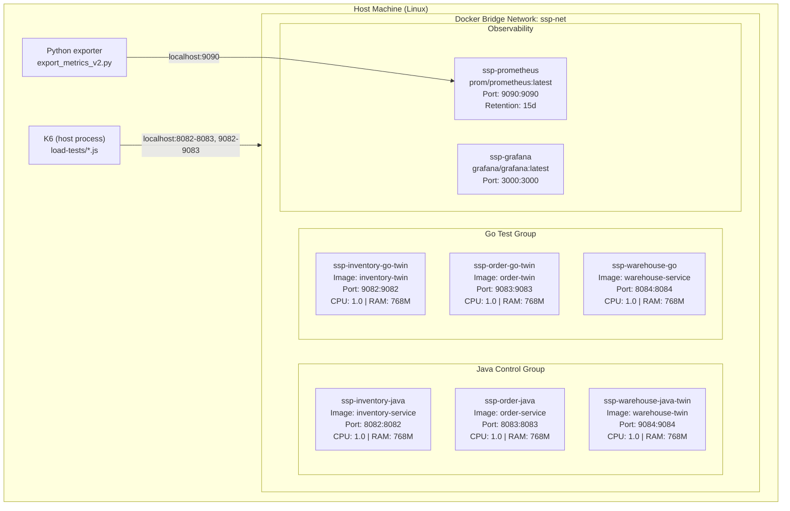
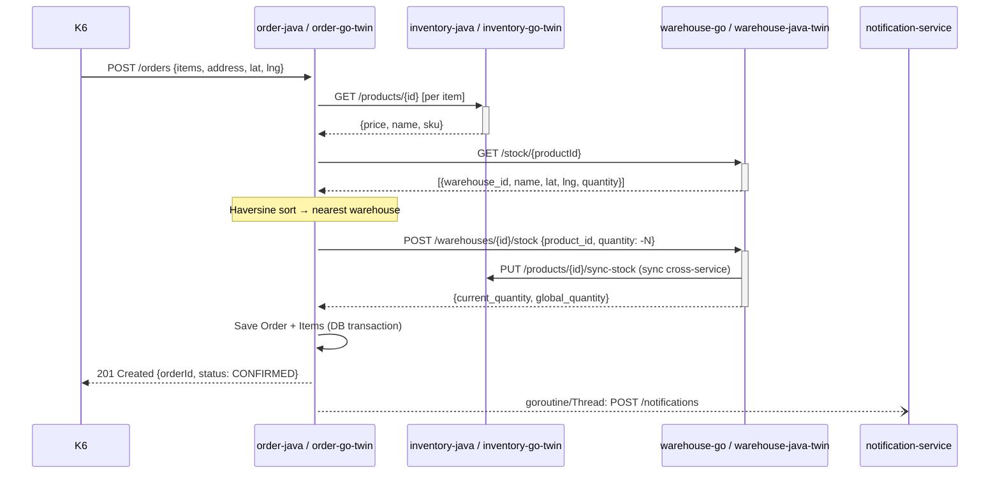

# 01 — System Architecture

---

## Full System Architecture Diagram

---

## Service Dependency Diagram

---

## Deployment Diagram (docker-compose.ssp.yml)

---

## Service Catalog

### inventory-java (Spring Boot)

| Property | Value |
| ---------- | ------- |
| **Port** | 8082 |
| **Runtime** | Java 21 / Spring Boot 4.0.2 |
| **Framework** | Spring MVC (Tomcat) |
| **Database** | inventory_db (PostgreSQL) |
| **ORM** | Spring Data JPA / Hibernate |
| **Metrics** | `/actuator/prometheus` (Micrometer) |
| **Caching** | Spring `@Cacheable` (in-memory, ConcurrentHashMap) |
| **APIs** | `GET /products`, `GET /products/{id}`, `POST /products`, `PUT /products/{id}/sync-stock` |
| **Key Feature** | `@Cacheable(value="products", key="#id")` on `getProductById()` |

### order-java (Spring Boot)

| Property | Value |
| ---------- | ------- |
| **Port** | 8083 |
| **Runtime** | Java 21 / Spring Boot 4.0.2 |
| **Framework** | Spring MVC (Tomcat) |
| **Database** | order_db (PostgreSQL), HikariCP |
| **ORM** | Spring Data JPA / Hibernate |
| **HTTP Client** | OpenFeign (declarative interfaces) |
| **Metrics** | `/actuator/prometheus` (Micrometer) |
| **APIs** | `POST /orders`, `GET /orders`, `GET /orders/all`, `PUT /orders/{id}/status` |
| **Key Feature** | Haversine warehouse routing, async notification via `new Thread()` |

### inventory-go-twin (Go Gin)

| Property | Value |
| ---------- | ------- |
| **Port** | 9082 |
| **Runtime** | Go 1.22+ |
| **Framework** | Gin Gonic |
| **Database** | inventory_db (PostgreSQL, same DB as Java!) |
| **ORM** | GORM |
| **Metrics** | `/metrics` (go-gin-prometheus + prometheus/client_golang) |
| **Caching** | `sync.RWMutex` over `map[string]models.Product` |
| **APIs** | Identical to inventory-java |
| **Key Feature** | Thread-safe read-through cache with RLock/RUnlock for reads, Lock/Unlock for writes |

### order-go-twin (Go Gin)

| Property | Value |
| ---------- | ------- |
| **Port** | 9083 |
| **Runtime** | Go 1.22+ |
| **Framework** | Gin Gonic |
| **Database** | order_db (PostgreSQL, same DB as Java!) |
| **ORM** | GORM |
| **HTTP Client** | `net/http` shared transport pool (MaxIdleConnsPerHost=50) |
| **Metrics** | `/metrics` (go-gin-prometheus + prometheus/client_golang) |
| **APIs** | Identical to order-java |
| **Key Feature** | Goroutine-based async notifications, GORM explicit transactions |

### warehouse-go (Go Gin) — Shared Service

| Property | Value |
| ---------- | ------- |
| **Port** | 8084 |
| **Runtime** | Go 1.22+ |
| **Database** | warehouse_db (warehouses, warehouse_stock) |
| **Key Feature** | Haversine distance JOIN, cross-service sync to inventory |
| **Used By** | order-java (Control Group) |

### warehouse-java-twin (Spring Boot) — Shared Service

| Property | Value |
| ---------- | ------- |
| **Port** | 9084 |
| **Runtime** | Java 21 / Spring Boot |
| **Key Feature** | Same Haversine routing, syncs to inventory-go-twin |
| **Used By** | order-go-twin (Test Group) |

### delivery-service (Go Gin) — Shared

| Property | Value |
|----------|-------|
| **Port** | 8085 |
| **Key Feature** | Creates shipment record + tracking number on `SHIPPED` status transition |

### notification-service (Go Gin) — Shared

| Property | Value |
|----------|-------|
| **Port** | 8086 |
| **Key Feature** | Logs notification events (ORDER_CONFIRMED, ORDER_SHIPPED) to notification_db |

---

## Network Communication Diagram

---

## Resource Equalization Summary

| Parameter | Java (HikariCP) | Go (database/sql) | Source |
| ----------- | ---------------- | ------------------- | -------- |
| Max DB connections | 50 (default HikariCP) | `SetMaxOpenConns(50)` | `db.go:29` |
| Idle DB connections | 10 (HikariCP default) | `SetMaxIdleConns(10)` | `db.go:30` |
| Connection lifetime | 30 min (HikariCP) | `SetConnMaxLifetime(30*time.Minute)` | `db.go:31` |
| Max HTTP idle conns/host | Feign default ~50 | `MaxIdleConnsPerHost: 50` | `httpclient.go:16` |
| HTTP idle timeout | 30s (default) | `IdleConnTimeout: 30*time.Second` | `httpclient.go:17` |
| Docker CPU limit | 1.0 | 1.0 | `docker-compose.ssp.yml:23-24` |
| Docker memory limit | 768M | 768M | `docker-compose.ssp.yml:25` |

