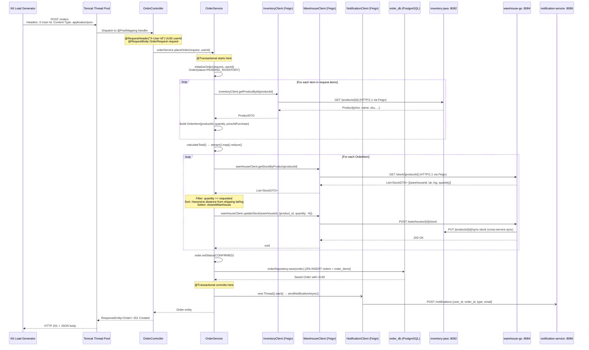
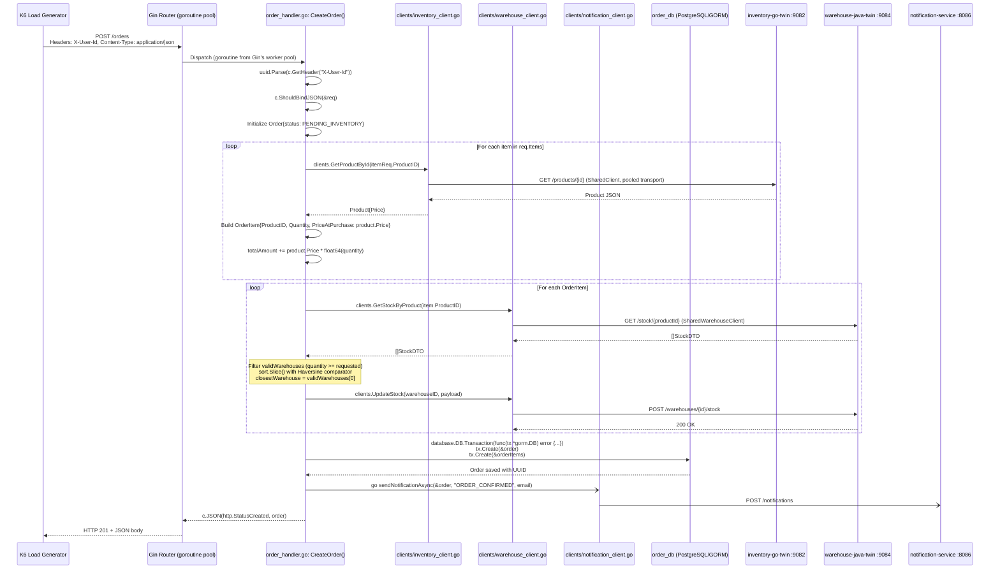
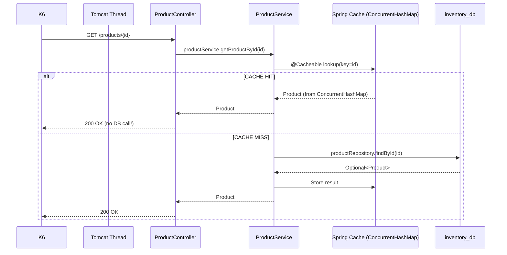
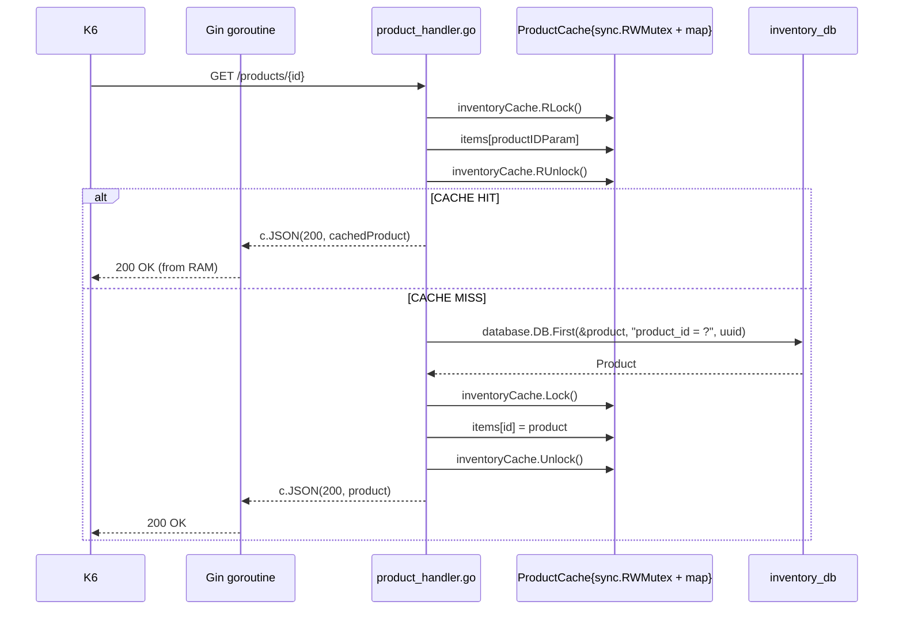
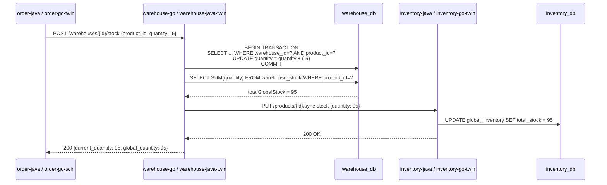

# 02 — Request Flow

---

## POST /orders — Complete Request Flow (Java Stack)

### Sequence Diagram



---

### Code Path Trace — POST /orders (Java)

| Step | File | Class | Method | Line |
| ------ | ------ | ------- | -------- | ------ |
| 1. HTTP Entry | `OrderController.java` | `OrderController` | `createOrder()` | L23-32 |
| 2. Service Dispatch | `OrderController.java` | `OrderController` | `orderService.placeOrder()` | L31 |
| 3. Order Init | `OrderService.java` | `OrderService` | `initializeOrder()` | L122-128 |
| 4. Product Fetch | `OrderService.java` | `OrderService` | `createOrderItems()` → `fetchProductFromInventory()` | L131-158 |
| 5. Feign Call | `InventoryClient.java` | `InventoryClient` | `getProductById()` | L13-14 |
| 6. Price Calc | `OrderService.java` | `OrderService` | `calculateTotal()` | L160-164 |
| 7. Stock Query | `OrderService.java` | `OrderService` | `attemptToAllocateItem()` | L176-209 |
| 8. Warehouse Feign | `WarehouseClient.java` | `WarehouseClient` | `getStockByProduct()` | L17-18 |
| 9. Haversine Sort | `OrderService.java` + `LocationUtils.java` | `OrderService` | `min(Comparator.comparingDouble(...))` | L182-191 |
| 10. Stock Deduct | `OrderService.java` | `OrderService` | `deductStockFromWareHouse()` | L211-227 |
| 11. DB Save | `OrderService.java` | `OrderService` | `orderRepository.save(order)` | L53 |
| 12. Async Notify | `OrderService.java` | `OrderService` | `sendNotificationAsync()` | L230-248 |

---

## POST /orders — Complete Request Flow (Go Stack)

### Sequence Diagram



---

### Code Path Trace — POST /orders (Go)

| Step | File | Function | Line |
| ------ | ------ | ---------- | ------ |
| 1. HTTP Entry | `cmd/main.go` | `orders.POST("", handlers.CreateOrder)` | L33 |
| 2. User ID Parse | `order_handler.go` | `CreateOrder()` | L47-52 |
| 3. JSON Bind | `order_handler.go` | `CreateOrder()` | L55-59 |
| 4. Product Fetch | `order_handler.go` | `CreateOrder()` loop | L74-88 |
| 5. HTTP Client | `clients/inventory_client.go` | `GetProductById()` | shared transport |
| 6. Warehouse Query | `order_handler.go` | `attemptToAllocateItem()` | L236-268 |
| 7. Haversine Sort | `order_handler.go` + `utils/location_utils.go` | `sort.Slice()` with `utils.CalculateDistance()` | L255-259 |
| 8. Stock Deduct | `order_handler.go` | `deductStockFromWarehouse()` | L271-285 |
| 9. GORM Transaction | `order_handler.go` | `database.DB.Transaction()` | L104-118 |
| 10. Async Notify | `order_handler.go` | `sendNotificationAsync()` | L287-311 |

---

## GET /products/{id} — Inventory Read Path

### Java Stack (Spring Cache)



**Key Code:** `ProductService.java:46`

```java
@Cacheable(value = "products", key = "#id")
public Product getProductById(UUID id){
    return productRepository.findById(id)
            .orElseThrow(() -> new RuntimeException("Product not found"));
}
```

### Go Stack (RWMutex Cache)



**Key Code:** `product_handler.go:17-106`

```go
type ProductCache struct {
    sync.RWMutex
    items map[string]models.Product
}

// Read path: multiple goroutines can read concurrently
inventoryCache.RLock()
cachedProduct, found := inventoryCache.items[productIDParam]
inventoryCache.RUnlock()

// Write path: exclusive lock to update cache
inventoryCache.Lock()
inventoryCache.items[productIDParam] = product
inventoryCache.Unlock()
```

---

## Inventory Update Flow (Cross-Service Sync)



> **Interview Point:** This cross-service sync is an eventual consistency pattern. The warehouse_db is the "source of truth" for physical stock. The inventory_db's `global_inventory` table is a **denormalized read model** that gets updated whenever warehouse stock changes. This avoids expensive cross-database JOINs during order placement.

---

## Notification Flow (Async)

### Java — Raw Thread

```java
// OrderService.java:230-248
private void sendNotificationAsync(Order order, String type, String recipientEmail){
    new Thread(() -> {
        try {
            Map<String, String> payload = Map.of(
                "user_id", order.getUserId().toString(),
                "order_id", order.getOrderId().toString(),
                "type", type,
                "recipient_email", recipientEmail,
                "total_amount", order.getTotalAmount().toString(),
                "shipping_address", order.getShippingAddress()
            );
            notificationClient.sendNotification(payload);
        } catch (Exception e) {
            log.error("Failed to send notification...", e);
        }
    }).start();
}
```

### Go — Goroutine

```go
// order_handler.go:287-311
func sendNotificationAsync(order *models.Order, notifType, recipientEmail string) {
    go func() {  // spawns a lightweight goroutine (~2KB stack vs 1MB Java thread)
        payload := map[string]string{
            "user_id":         order.UserID.String(),
            "order_id":        orderID,
            "type":            notifType,
            "recipient_email": recipientEmail,
        }
        _, err := clients.SendNotification(payload)
        // fire-and-forget: error is logged, not propagated
    }()
}
```

> **Interview Point:** Both implementations use fire-and-forget async. The critical difference is: Java creates an OS thread (1MB+ stack, kernel-scheduled), while Go spawns a goroutine (~2KB stack, user-space scheduled by Go runtime). At 200 concurrent order requests, Java could theoretically spawn 200 notification threads on top of the request-handling threads, while Go's goroutines are extremely cheap.

---

## Warehouse Allocation — Haversine Algorithm

### Java Implementation

```java
// OrderService.java:176-209
private boolean attemptToAllocateItem(OrderItem item, OrderRequest request){
    List<StockDTO> warehouses = warehouseClient.getStockByProduct(item.getProductId());

    StockDTO closestWarehouse = warehouses.stream()
        .filter(wh -> wh.getQuantity() >= item.getQuantity())  // Availability filter
        .min(Comparator.comparingDouble(wh -> {
            double userLat = request.getShippingLatitude() != null ? request.getShippingLatitude() : 0.0;
            double userLng = request.getShippingLongitude() != null ? request.getShippingLongitude() : 0.0;
            return LocationUtils.calculateDistance(userLat, userLng, wh.getLatitude(), wh.getLongitude());
        }))
        .orElse(null);
    // ...
}
```

### Go Implementation

```go
// order_handler.go:236-268
func attemptToAllocateItem(item models.OrderItem, userLat, userLng float64) bool {
    var validWarehouses []clients.StockDTO
    for _, w := range warehouses {
        if w.Quantity >= item.Quantity {
            validWarehouses = append(validWarehouses, w)
        }
    }
    sort.Slice(validWarehouses, func(i, j int) bool {
        distI := utils.CalculateDistance(userLat, userLng, validWarehouses[i].Latitude, validWarehouses[i].Longitude)
        distJ := utils.CalculateDistance(userLat, userLng, validWarehouses[j].Latitude, validWarehouses[j].Longitude)
        return distI < distJ
    })
    closestWarehouse := validWarehouses[0]
    // ...
}
```

### Haversine Formula

```java
// LocationUtils.java
// a = sin²(Δφ/2) + cos φ1 ⋅ cos φ2 ⋅ sin²(Δλ/2)
// c = 2 ⋅ atan2( √a, √(1−a) )
// d = R ⋅ c  where R = 6371 km

double a = Math.pow(Math.sin(dLat / 2), 2) +
        Math.cos(startLat) * Math.cos(endLat) *
                Math.pow(Math.sin(dLong / 2), 2);
double c = 2 * Math.atan2(Math.sqrt(a), Math.sqrt(1 - a));
return EARTH_RADIUS_KM * c;
```mermaid
