# 07 — Database Design

---

## ER Diagram

```mermaid
erDiagram
    USERS {
        UUID user_id PK
        VARCHAR username UK
        VARCHAR email UK
        VARCHAR password_hash
        VARCHAR role "CHECK(CUSTOMER|ADMIN|WAREHOUSE_MANAGER)"
        TIMESTAMP created_at
    }

    PRODUCTS {
        UUID product_id PK
        VARCHAR sku UK
        VARCHAR name
        TEXT description
        DECIMAL price
        VARCHAR image_url
        TIMESTAMP created_at
        INT low_stock_threshold
    }

    GLOBAL_INVENTORY {
        UUID id PK
        UUID product_id UK "Logical FK to products"
        INT total_stock
        INT reserved_stock
        TIMESTAMP updated_at
    }

    ORDERS {
        UUID order_id PK
        UUID user_id "Logical FK to users"
        DECIMAL total_amount
        VARCHAR status "CHECK(CREATED|PENDING_INVENTORY|CONFIRMED|SHIPPED|DELIVERED|CANCELLED)"
        TEXT shipping_address
        TIMESTAMP created_at
        TIMESTAMP updated_at
    }

    ORDER_ITEMS {
        UUID id PK
        UUID order_id FK
        UUID product_id "Logical FK to products"
        INT quantity
        DECIMAL price_at_purchase
    }

    WAREHOUSES {
        UUID warehouse_id PK
        VARCHAR name
        VARCHAR location
        INT capacity
        FLOAT latitude
        FLOAT longitude
    }

    WAREHOUSE_STOCK {
        UUID id PK
        UUID warehouse_id FK
        UUID product_id "Logical FK to products"
        INT quantity
        TIMESTAMP updated_at
    }

    SHIPMENTS {
        UUID shipment_id PK
        UUID order_id UK "Logical FK to orders"
        UUID warehouse_id "Logical FK to warehouses"
        VARCHAR tracking_number UK
        VARCHAR status "CHECK(PREPARING|PICKED_UP|IN_TRANSIT|DELIVERED|FAILED)"
        TIMESTAMP estimated_delivery
        TIMESTAMP created_at
        TIMESTAMP updated_at
    }

    NOTIFICATIONS {
        UUID notification_id PK
        UUID user_id "Logical FK to users"
        UUID order_id "Logical FK to orders"
        VARCHAR type
        VARCHAR status "CHECK(SENT|FAILED)"
        TIMESTAMP sent_at
    }

    PRODUCTS ||--o{ GLOBAL_INVENTORY : "tracks global stock"
    ORDERS ||--|{ ORDER_ITEMS : "contains"
    WAREHOUSES ||--|{ WAREHOUSE_STOCK : "holds"
    ORDERS ||--o| SHIPMENTS : "ships via"
```



---

## Database-per-Service Pattern

| Database | Owner Service | Runtime | Tables |
| ---------- | -------------- | --------- | -------- |
| `auth_db` | auth-service | Spring Boot | `users` |
| `inventory_db` | inventory-service / inventory-twin | Spring + Go | `products`, `global_inventory` |
| `order_db` | order-service / order-twin | Spring + Go | `orders`, `order_items` |
| `warehouse_db` | warehouse-go / warehouse-java-twin | Go + Spring | `warehouses`, `warehouse_stock` |
| `delivery_db` | delivery-service | Go | `shipments` |
| `notification_db` | notification-service | Go | `notifications` |

> **Critical Design Point:** `inventory_db` is shared between `inventory-java` (port 8082) and `inventory-go-twin` (port 9082). Both services connect to the SAME database, just through different service implementations. This is the "twin" architecture — two runtimes, one data source.

---

## Table Descriptions

### `users` — auth_db

```sql
CREATE TABLE users (
    user_id UUID PRIMARY KEY DEFAULT gen_random_uuid(),
    username VARCHAR(50) UNIQUE NOT NULL,
    email VARCHAR(100) UNIQUE NOT NULL,
    password_hash VARCHAR(255) NOT NULL,
    role VARCHAR(20) NOT NULL CHECK (role IN ('CUSTOMER', 'ADMIN', 'WAREHOUSE_MANAGER')),
    created_at TIMESTAMP DEFAULT CURRENT_TIMESTAMP
);
```

- `CHECK` constraint enforces role enum at DB level (defense-in-depth)
- `password_hash` — never store plaintext passwords
- **No integration with other services via JOIN** — only `user_id` UUID is passed around

### `products` — inventory_db

```sql
CREATE TABLE products (
    product_id UUID PRIMARY KEY DEFAULT gen_random_uuid(),
    sku VARCHAR(50) UNIQUE NOT NULL,
    name VARCHAR(100) NOT NULL,
    price DECIMAL(10, 2) NOT NULL,
    created_at TIMESTAMP DEFAULT CURRENT_TIMESTAMP,
    low_stock_threshold INT DEFAULT 10
);
```

- `sku` — Stock Keeping Unit, unique product identifier (e.g., "IPHONE-15-BLK")
- `DECIMAL(10, 2)` — exact numeric, avoids floating-point precision issues for prices
- `low_stock_threshold` — could trigger alerts when `global_inventory.total_stock` drops below this

### `global_inventory` — inventory_db

```sql
CREATE TABLE global_inventory (
    id UUID PRIMARY KEY DEFAULT gen_random_uuid(),
    product_id UUID UNIQUE NOT NULL,  -- One row per product
    total_stock INT NOT NULL DEFAULT 0,
    reserved_stock INT NOT NULL DEFAULT 0,
    updated_at TIMESTAMP DEFAULT CURRENT_TIMESTAMP
);
-- Available stock formula: total_stock - reserved_stock
```

**Key Design:** `global_inventory` is the aggregated view of stock across ALL warehouses. It's a **denormalized read model** — maintained in sync by the warehouse service calling `PUT /products/{id}/sync-stock` whenever warehouse stock changes.

**Formula:**

- `total_stock` = Sum of all warehouse_stock.quantity for this product
- `reserved_stock` = Stock reserved for pending orders (not yet confirmed)
- `available_to_sell` = `total_stock - reserved_stock`

**Interview Point:** `reserved_stock` is not actively used in the benchmark workflow — `total_stock` is decremented directly on order confirmation. In a full implementation, the checkout flow would: (1) increment `reserved_stock`, (2) decrement on payment confirmation, (3) rollback reservation on payment failure.

### `orders` — order_db

```sql
CREATE TABLE orders (
    order_id UUID PRIMARY KEY DEFAULT gen_random_uuid(),
    user_id UUID NOT NULL,           -- Logical reference (no FK to auth_db)
    total_amount DECIMAL(10, 2) NOT NULL,
    status VARCHAR(20) NOT NULL CHECK (status IN (
        'CREATED', 'PENDING_INVENTORY', 'CONFIRMED', 'SHIPPED', 'DELIVERED', 'CANCELLED'
    )),
    shipping_address TEXT NOT NULL,
    created_at TIMESTAMP DEFAULT CURRENT_TIMESTAMP,
    updated_at TIMESTAMP DEFAULT CURRENT_TIMESTAMP
);
```

**Order Status Lifecycle:**

```text
CREATED → PENDING_INVENTORY → CONFIRMED → SHIPPED → DELIVERED
                                    └→ CANCELLED
```

Note: In the benchmark workflow, orders are placed from `PENDING_INVENTORY` directly to `CONFIRMED` (skipping `CREATED`). The `initializeOrder()` method sets `status = PENDING_INVENTORY`, then after all stock allocation, sets `status = CONFIRMED`.

### `order_items` — order_db

```sql
CREATE TABLE order_items (
    id UUID PRIMARY KEY DEFAULT gen_random_uuid(),
    order_id UUID REFERENCES orders(order_id) ON DELETE CASCADE,
    product_id UUID NOT NULL,        -- Logical reference (no FK to inventory_db)
    quantity INT NOT NULL,
    price_at_purchase DECIMAL(10, 2) NOT NULL  -- Snapshot: never changes
);
```

**`price_at_purchase` Design Decision:**

- Stores price at the moment of order placement
- Product price can change over time, but order history must reflect original price
- Without this, historical order totals would change retroactively — incorrect

**`ON DELETE CASCADE`:**

- Deleting an order automatically deletes all its items
- No orphaned `order_items` rows

### `warehouses` + `warehouse_stock` — warehouse_db

```sql
CREATE TABLE warehouses (
    warehouse_id UUID PRIMARY KEY DEFAULT gen_random_uuid(),
    name VARCHAR(100) NOT NULL,    -- e.g., "East Coast Fulfillment Center"
    location VARCHAR(255) NOT NULL,
    capacity INT NOT NULL,
    -- NOTE: latitude and longitude added later (not in schema.sql but used in queries)
    latitude FLOAT,
    longitude FLOAT
);

CREATE TABLE warehouse_stock (
    id UUID PRIMARY KEY DEFAULT gen_random_uuid(),
    warehouse_id UUID REFERENCES warehouses(warehouse_id),
    product_id UUID NOT NULL,
    quantity INT NOT NULL,
    updated_at TIMESTAMP DEFAULT CURRENT_TIMESTAMP
);
```

**Haversine Query Join (warehouse_handler.go:167-171):**

```go
database.DB.Table("warehouses").
    Select("warehouses.warehouse_id, warehouses.name, warehouses.location, " +
           "warehouses.latitude, warehouses.longitude, warehouse_stock.quantity").
    Joins("JOIN warehouse_stock ON warehouse_stock.warehouse_id = warehouses.warehouse_id").
    Where("warehouse_stock.product_id = ? AND warehouse_stock.quantity > 0", productIDParam).
    Scan(&results)
```

This is equivalent to:

```sql
SELECT w.warehouse_id, w.name, w.location, w.latitude, w.longitude, ws.quantity
FROM warehouses w
JOIN warehouse_stock ws ON ws.warehouse_id = w.warehouse_id
WHERE ws.product_id = ? AND ws.quantity > 0;
```

The Haversine distance computation happens **in the application layer** (not SQL), because SQL doesn't natively support great-circle distance calculations without PostGIS extension.

### `shipments` — delivery_db

```sql
CREATE TABLE shipments (
    shipment_id UUID PRIMARY KEY DEFAULT gen_random_uuid(),
    order_id UUID UNIQUE NOT NULL,        -- One shipment per order
    warehouse_id UUID NOT NULL,
    tracking_number VARCHAR(50) UNIQUE,
    status VARCHAR(20) CHECK (status IN ('PREPARING','PICKED_UP','IN_TRANSIT','DELIVERED','FAILED')),
    estimated_delivery TIMESTAMP,
    created_at TIMESTAMP DEFAULT CURRENT_TIMESTAMP
);
```

### `notifications` — notification_db

```sql
CREATE TABLE notifications (
    notification_id UUID PRIMARY KEY DEFAULT gen_random_uuid(),
    user_id UUID NOT NULL,
    order_id UUID,                         -- Nullable: some notifications are non-order
    type VARCHAR(50) NOT NULL,             -- "ORDER_CONFIRMED", "ORDER_SHIPPED"
    status VARCHAR(20) CHECK (status IN ('SENT', 'FAILED')),
    sent_at TIMESTAMP DEFAULT CURRENT_TIMESTAMP
);
```

---

## Database Normalization Analysis

| Table | Normal Form | Notes |
| ------- | ------------- | ------- |
| `users` | 3NF | All attributes depend solely on PK |
| `products` | 3NF | SKU is a candidate key; price is atomic |
| `global_inventory` | 3NF | Denormalized for performance (aggregated view) |
| `orders` | 3NF | `user_id` is a logical reference, not normalized across DBs |
| `order_items` | 3NF | `price_at_purchase` is intentionally denormalized (historical snapshot) |
| `warehouses` | 3NF | `latitude`/`longitude` functionally depend on PK |
| `warehouse_stock` | 3NF | Composite logical key (warehouse_id + product_id) |

**Intentional Denormalization:**

- `order_items.price_at_purchase` — Denormalized to capture historical price
- `global_inventory.total_stock` — Denormalized aggregate of `SUM(warehouse_stock.quantity)`

---

## Transaction Boundaries

### Order Service Transaction (Java)

```text
@Transactional scope in OrderService.placeOrder():
┌─────────────────────────────────────────────────────────────┐
│ BEGIN TRANSACTION                                            │
│                                                             │
│   Order order = initializeOrder();    // No DB yet          │
│   List<OrderItem> items = createOrderItems();               │
│     ↳ inventoryClient.getProductById() [FEIGN - NOT IN TX]  │
│   allocateStock();                                          │
│     ↳ warehouseClient.getStockByProduct() [FEIGN - NOT IN TX]│
│     ↳ warehouseClient.updateStock() [FEIGN - NOT IN TX]     │
│   orderRepository.save(order)         // INSERT orders      │
│     ↳ CascadeType.ALL → INSERT order_items                  │
│                                                             │
│ COMMIT (or ROLLBACK on RuntimeException)                    │
└─────────────────────────────────────────────────────────────┘
```

### Order Twin Transaction (Go)

```text
database.DB.Transaction() scope:
┌─────────────────────────────────────────────────────────────┐
│ BEGIN TRANSACTION                                            │
│                                                             │
│   tx.Create(&order)         // INSERT INTO orders           │
│   tx.Create(&orderItems)    // INSERT INTO order_items (batch)│
│                                                             │
│ COMMIT (nil return)                                          │
│ ROLLBACK (error return)                                      │
└─────────────────────────────────────────────────────────────┘
```

**Key Difference:** In Go, the transaction is explicit and wraps ONLY the DB operations. In Java, `@Transactional` wraps the entire method including Feign calls (which are outside the DB transaction scope).

---

## Database Access Patterns

| Access Pattern | Service | Frequency | Index Benefit |
| --------------- | --------- | ----------- | --------------- |
| `SELECT * FROM products WHERE product_id = ?` | inventory | Very High (cached after first hit) | PK index (automatic) |
| `SELECT * FROM orders WHERE user_id = ?` | order | Medium | Needs index on `user_id` |
| `SELECT ... FROM warehouse_stock JOIN warehouses WHERE product_id = ?` | warehouse | High (per order item) | Needs index on `product_id` in warehouse_stock |
| `INSERT INTO orders, INSERT INTO order_items` | order | High (benchmark write workload) | PK-only |
| `UPDATE warehouse_stock SET quantity = ? WHERE warehouse_id = ? AND product_id = ?` | warehouse | High | Needs composite index on (warehouse_id, product_id) |

---

## Database Performance Implications

**HikariCP vs `database/sql` Pool:**

```text
Java HikariCP:
- Default max pool size: 10 (overridden to 50 in this project via spring.datasource.hikari.maximum-pool-size)
- Validates connections with SELECT 1 before giving to thread
- Metrics: hikaricp_connections_active, hikaricp_connections_pending

Go database/sql:
- SetMaxOpenConns(50) — matches Java
- SetMaxIdleConns(10) — matches Java minimum-idle
- SetConnMaxLifetime(30*time.Minute) — matches HikariCP connectionTimeout behavior
- Metrics: go_sql_in_use_connections, go_sql_open_connections, go_sql_idle_connections
```

**Why Max 50 Connections?**
PostgreSQL has a default `max_connections = 100`. With 6 microservices each potentially opening 50 connections, we'd exceed 300 connections. The 50-connection limit is intentionally conservative for this benchmark — it represents a resource constraint equal across both runtimes.

---

## Interview Questions — Database

1. **Why separate databases per service instead of one shared database?**
   → Microservice data isolation. Each service owns its schema. No coupling. Services can use different DB technologies. One DB outage doesn't cascade.

2. **What is a "logical FK" vs a real FK?**
   → `order_items.product_id` references `products.product_id` in a different database. No actual DB foreign key exists — the relationship is enforced at the application layer. A real FK would require cross-database JOIN capability (not possible in separate PostgreSQL instances).

3. **Why use UUID instead of auto-increment integer PKs?**
   → UUIDs are globally unique without coordination. Multiple services can generate IDs independently. Auto-increment requires a DB sequence (single point of coordination). UUIDs also don't expose business information (you can't guess the next order ID).

4. **What is the purpose of `global_inventory` when `warehouse_stock` also tracks quantity?**
   → `warehouse_stock` tracks WHERE stock is (per warehouse). `global_inventory` tracks HOW MUCH stock exists globally (aggregate). The order service queries `global_inventory` for availability checks without scanning all warehouses. It's a CQRS-style read model maintained by eventual consistency.

5. **Why store `price_at_purchase` in `order_items`?**

```mermaid
