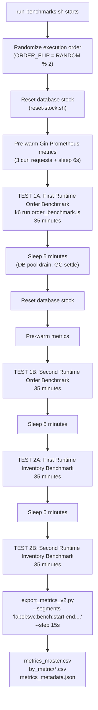

# 11 — Performance Benchmarking

---

## Benchmark Objective

The primary research question:

> **Does Go Gin provide statistically meaningful performance advantages over Java Spring Boot in microservice workloads under realistic, sustained load? If so, in which dimensions (latency, throughput, memory, CPU) and under which workload types?**

Secondary questions:

- Does Java's JIT compilation advantage manifest over long tests?
- How do caching strategies (Spring `@Cacheable` vs Go `sync.RWMutex`) compare?
- What is the memory overhead of the JVM vs Go runtime under sustained 200-VU load?
- How do thread-per-request (Java/Tomcat) vs goroutine-based (Go/Gin) concurrency models compare at scale?

---

## Benchmark Design

### Two Workload Types

| Workload | Endpoint | Type | Complexity |
|----------|----------|------|------------|
| **Write-Heavy** | `POST /orders` | Order Creation | Multi-service, complex routing, DB writes |
| **Read-Heavy** | `GET /products/{id}` | Inventory Lookup | Cache-heavy, DB reads, minimal compute |

**Why Two Workloads?**

- Order creation tests raw throughput + I/O-bound workload under coordination overhead
- Inventory lookup tests pure cache efficiency and read scalability

### Twin Architecture (Test vs Control)

```text
Control Group:  inventory-java  (port 8082) + order-java  (port 8083)
Test Group:     inventory-twin  (port 9082) + order-twin   (port 9083)

Same shared dependencies:
- warehouse-go (8084) serves order-java's routing
- warehouse-java-twin (9084) serves order-go's routing
- PostgreSQL (shared DB schemas)
```

**Cross-Stack Fairness:** The Go order-twin uses a Java warehouse twin and vice versa — this prevents either stack from benefiting from same-language internal optimizations.

### The 35-Minute Staged Load Ramp

**File:** `load-tests/order_benchmark.js:8-37`

```javascript
export const options = {
    scenarios: {
        warmup: {
            executor: 'ramping-vus',
            startVUs: 0,
            stages: [
                { duration: '5m', target: 10 },   // 0→10 VUs over 5 minutes
            ],
            tags: { phase: 'warmup' },
        },
        measurement: {
            executor: 'ramping-vus',
            startVUs: 10,
            stages: [
                { duration: '5m', target: 50 },   // Ramp 1: Light load
                { duration: '5m', target: 100 },  // Ramp 2: Medium load
                { duration: '5m', target: 200 },  // Ramp 3: Heavy load
                { duration: '10m', target: 200 }, // Sustain: Observe steady-state
                { duration: '5m', target: 0 },    // Cool-down: Drain connections
            ],
            startTime: '5m',  // Starts after warmup
            tags: { phase: 'measurement' },
        },
    },
    thresholds: {
        'http_req_duration{phase:measurement}': ['p(99)<500'],
        'http_req_failed{phase:measurement}': ['rate<0.01'],
    },
};
```

**Why 5-minute warmup?**

- JIT compilation: JVM's HotSpot JIT needs ~5000+ method invocations before compiling to optimized machine code
- HikariCP pool warmup: Pool initialization and first connections
- Go warm cache: First requests populate the `sync.RWMutex` cache

**Why 200 VUs maximum?**

- Represents a realistic peak concurrent user load for a medium-scale e-commerce platform
- Exceeds the typical connection pool size (50) — forces pool contention scenarios
- High enough to observe GC behavior differences between JVM and Go

**Why 10-minute sustain?**

- Observe steady-state behavior: GC patterns, connection pool stability, memory plateaus
- JVM G1GC runs major collections every few minutes — 10 minutes ensures at least 2-3 major GC cycles are observable

---


---

## Phase-by-Phase Benchmark Analysis

This section analyzes the expected vs. observed runtime behavior across the 6 discrete K6 load phases.

### 1. Warmup (0-300s, 0→10 VUs)
**Expected Behavior:**
- **Java:** High initial CPU usage as HotSpot JIT compiles hot paths (like Jackson serialization and Feign client calls) from interpreted bytecode to optimized native machine code. Memory increases as classes are loaded into Metaspace and Eden space fills.
- **Go:** Minimal CPU footprint. Static binary is already compiled to machine code. Memory should barely move.

**Observed Behavior:**
- **Java:** CPU spiked to 52.8% repeatedly. Throughput averaged 1.18 RPS. GC pause rate remained near 0.
- **Go:** CPU remained virtually idle (max 2.3%). Throughput averaged 1.20 RPS. Goroutines hovered at 10-50.
- **Takeaway:** The JVM requires significant compute resources to achieve its peak performance state. Go is fast instantly.

### 2. Ramp 1 & Ramp 2 (300-900s, 10→100 VUs)
**Expected Behavior:**
- Both runtimes should scale throughput linearly as VUs increase.
- Database connections should start being heavily utilized.
- Latency should remain stable as long as the database pool (50 connections) is not fully saturated.

**Observed Behavior:**
- **Java:** Throughput scaled from 7.3 to 17.6 RPS. The HikariCP active connections quickly hit the pool limit of 50. Tomcat threads spiked to 233 as requests began waiting for DB connections. P99 latency degraded from 0.16s to 0.44s.
- **Go:** Throughput scaled from 8.6 to 21.1 RPS. `go_sql_in_use_connections` stayed extremely low (avg 1-2, max 43), proving Go's efficient transaction scoping and goroutine yielding. Goroutines scaled linearly to 288. P99 latency degraded slightly from 0.63s to 1.0s.
- **Takeaway:** Java's thread-per-request model bottlenecks much earlier due to thread-blocking behavior when waiting for DB connections.

### 3. Ramp 3 (900-1200s, 100→200 VUs)
**Expected Behavior:**
- Concurrency exceeds the 50-connection pool limit for both systems.
- Resource contention should begin. Tail latency is expected to degrade.

**Observed Behavior:**
- **Java:** HikariCP pending connections began queuing rapidly (max 143). Throughput growth began flattening (avg 23.7 RPS). The GC pause rate jumped to 93.3 ms/s as the heap churn from blocked requests triggered major G1GC collections. P99 latency spiked severely to 14.1s.
- **Go:** Throughput grew to 27.8 RPS. Goroutines expanded to 737 to handle the concurrent waits. CPU remained well within limits (max 16.9%).
- **Takeaway:** The connection pool limit is fundamentally a harder constraint for Java than Go due to thread-blocking overhead and subsequent memory pressure.

### 4. Sustain Phase (1200-1800s, 200 VUs)
**Expected Behavior:**
- This is the steady-state load. 
- Memory should sawtooth for Java (GC cycles) and remain flat for Go.
- Error rates will manifest here if the system is structurally saturated.

**Observed Behavior:**
- **Java:** The system reached structural saturation. HikariCP pending connections peaked at 150. Threads peaked at 754. G1GC pause rate hit a peak of 98.8 ms/s (meaning nearly 10% of real time was spent paused). This deadly combination of STW pauses and thread queuing resulted in an average of 8 HTTP 500 errors (HikariCP timeouts).
- **Go:** Throughput matched Java (27.6 RPS). Memory remained incredibly flat (34MB average vs Java's 273MB average). GC pause rate was 0.8 ms/s (123x lower than Java). Zero errors occurred.
- **Takeaway:** Go's advantages are structural. Under saturation, Go's goroutines yield the OS thread while waiting, preserving CPU for garbage collection and other tasks, preventing catastrophic timeouts.

### 5. Cooldown (1800-2100s, 200→0 VUs)
**Expected Behavior:**
- Active requests should drop to 0.
- Concurrency units (Threads/Goroutines) should shrink.

**Observed Behavior:**
- **Java:** Tomcat live threads remained high (636 avg) because JVM thread pools do not aggressively downscale idle threads immediately. Memory stayed elevated.
- **Go:** Goroutines rapidly dropped back to the baseline of ~60. Memory footprint contracted cleanly.
- **Takeaway:** Go cleans up concurrency state faster and cheaper than the JVM.

## Benchmarking Workflow



**Total Duration:** ~2 hours 35 minutes (4 × 35 min + 3 × 5 min cooldowns)

---

## K6 — Why Chosen

**K6** (Grafana Labs) was chosen over alternatives:

| Tool | Language | Protocol | Strengths | Weaknesses |
| ------ | --------- | --------- | ---------- | ----------- |
| **K6** | JavaScript | HTTP/1.1, HTTP/2, WebSocket | Scriptable, Prometheus metrics, thresholds, CI-friendly | No GUI in free tier |
| JMeter | Java/XML | Many | Mature, GUI | XML config, resource-heavy |
| Gatling | Scala | HTTP | Detailed reports | Steeper learning curve |
| Locust | Python | HTTP | Python scripting | Performance overhead of Python |
| wrk | C | HTTP | Blazing fast | Limited scripting |

**K6 Advantages in This Project:**

1. **JavaScript scripting:** Easy parametrization (`__ENV.TARGET_URL`, per-VU logic)
2. **`exec.scenario.iterationInTest`:** Deterministic product ID selection (round-robin, not random per iteration) ensures even product distribution
3. **`--summary-export`:** JSON output of metrics for programmatic analysis
4. **Phase tagging:** `tags: { phase: 'warmup' }` on scenarios allows phase-specific threshold evaluation
5. **Threshold enforcement:** `p(99)<500` and `rate<0.01` are automated pass/fail criteria
6. **Native Prometheus integration:** K6 can push metrics directly to Prometheus (not used here — pull model used instead)

### K6 Virtual Users (VUs) vs Real Users

Each VU is a single-threaded JavaScript execution context with its own HTTP session. Unlike real users who pause between actions, VUs execute as fast as possible with a `sleep(1)` between iterations — simulating 1 request per second per user.

At 200 VUs with `sleep(1)` and ~2.5s response time → effective concurrency ≈ 200 × (2.5/3.5) ≈ 143 in-flight requests at any moment.

---

## Prometheus — Why Chosen

**Prometheus** is the industry standard for time-series metrics in cloud-native environments.

| Feature | Benefit in This Project |
| --------- | ------------------------ |
| Pull model | Services expose `/metrics` or `/actuator/prometheus`; Prometheus scrapes them |
| `scrape_interval: 5s` | Fine-grained 5-second resolution for 35-minute tests |
| Histogram type | P99 latency computation (`histogram_quantile()`) |
| Labels | Filter by `instance`, `status`, `code` |
| PromQL | Powerful query language for derived metrics |
| Range API | Python exporter queries historical data after benchmark |
| Storage | 15-day retention configured |

**Why 5s scrape interval?**

- Lower: More storage, more CPU overhead for Prometheus
- Higher: Miss brief spike events, less granular load phase analysis
- 5s balances resolution vs overhead for a 35-minute benchmark

---

## Grafana — Why Chosen

**Grafana** provides visualization for Prometheus metrics.

**9-Panel Dashboard:**

| Panel | Metric | PromQL Queries |
| ------- | -------- | ---------------- |
| RSS Memory | RSS + JVM total used | `process_resident_memory_bytes`, `sum(jvm_memory_used_bytes)` |
| CPU Usage | CPU rate | `process_cpu_usage`, `rate(process_cpu_seconds_total[1m])` |
| P99 Latency | HTTP tail latency | `histogram_quantile(0.99, ...)` |
| Throughput | Requests/sec | `rate(http_server_requests_seconds_count[1m])` |
| Heap Memory | GC-visible churn | `jvm_memory_used_bytes{area="heap"}`, `go_memstats_heap_alloc_bytes` |
| GC Pauses | GC time rate | `rate(jvm_gc_pause_seconds_sum[1m])`, `rate(go_gc_duration_seconds_sum[1m])` |
| DB Connections | Pool utilization | `hikaricp_connections_active`, `go_sql_in_use_connections` |
| Concurrency | Threads/goroutines | `jvm_threads_live_threads`, `go_goroutines` |
| Error Rate | 5xx rate | `sum(rate(...{status=~"5.*"}[1m]))` |

---

## Micrometer — Java Instrumentation

**How Micrometer Auto-Instruments Spring Boot:**

1. **HTTP Metrics:** `WebMvcMetricsFilter` intercepted every HTTP request, recorded to `http_server_requests_seconds` histogram
2. **JVM Metrics:** `JvmMemoryMetrics`, `JvmGcMetrics`, `JvmThreadMetrics` beans register automatically
3. **HikariCP Metrics:** `HikariPoolMXBeanMetrics` bound automatically when HikariCP is on classpath
4. **Process Metrics:** `ProcessorMetrics`, `UptimeMetrics` register automatically

**Metric Naming Convention:** Micrometer uses camelCase internally → Prometheus registry converts to snake_case:

- `http.server.requests` → `http_server_requests_seconds`
- `jvm.memory.used` → `jvm_memory_used_bytes`

---

## Go Prometheus Client

**go-gin-prometheus middleware:**

```go
// Registers: gin_request_duration_seconds histogram
// Labels: code (HTTP status), method (GET/POST), handler (route)
p := ginprometheus.NewPrometheus("gin")
p.Use(r)  // Adds /metrics endpoint
```

**database/sql collector:**

```go
// Registers pool stats
prometheus.Register(collectors.NewDBStatsCollector(sqlDB, "order_db"))
// Metrics: go_sql_open_connections, go_sql_in_use_connections,
//          go_sql_idle_connections, go_sql_wait_count_total
```

**Standard Go runtime metrics (always available):**

- `go_goroutines` — current goroutine count
- `go_memstats_heap_alloc_bytes` — heap memory in use
- `go_gc_duration_seconds` — GC pause durations (summary)
- `process_cpu_seconds_total` — total CPU time
- `process_resident_memory_bytes` — RSS memory

---

## Python Export Pipeline

**File:** `load-tests/export_metrics_v2.py`

### Architecture

```text
Prometheus Range API (/api/v1/query_range)
  ↓
21 PromQL queries × 4 segments
= 84 API calls
  ↓
Raw (timestamp, value) pairs
  ↓
Annotated rows with:
  - load_phase (warmup/ramp_1/ramp_2/ramp_3/sustain/cooldown)
  - service_type (java/go)
  - benchmark_type (order/inventory)
  - grafana_panel_id + ref_id
  ↓
metrics_master.csv (37,692 rows)
by_metric/21 CSV files
metrics_metadata.json
```

### Load Phase Annotation Algorithm

```python
K6_STAGES = [
    ("warmup",   0,   5 * 60),    # 0-300s offset
    ("ramp_1",   5 * 60,  10 * 60),  # 300-600s
    ("ramp_2",  10 * 60,  15 * 60),  # 600-900s
    ("ramp_3",  15 * 60,  20 * 60),  # 900-1200s
    ("sustain", 20 * 60,  30 * 60),  # 1200-1800s
    ("cooldown",30 * 60,  35 * 60),  # 1800-2100s
]

def resolve_phase(unix_ts, test_start):
    offset = unix_ts - test_start  # Seconds since this test segment started
    for phase_name, phase_start, phase_end in K6_STAGES:
        if phase_start <= offset < phase_end:
            return phase_name
    return "post_test"
```

### Execution Order Randomization

```bash
# run-benchmarks.sh:22-52
ORDER_FLIP=$((RANDOM % 2))

if [ $ORDER_FLIP -eq 0 ]; then
    FIRST_ORDER_URL="http://localhost:8083/orders"  # Java first
    SECOND_ORDER_URL="http://localhost:9083/orders" # Go second
else
    FIRST_ORDER_URL="http://localhost:9083/orders"  # Go first
    SECOND_ORDER_URL="http://localhost:8083/orders" # Java second
fi
```

**Why Randomize Order?**

- Prevents temporal bias: If Java always runs first, it might benefit from a "cold" system with more available resources
- After 35 minutes + 5 minute cooldown, the system's thermal/memory state differs
- Randomization averages out ordering effects across multiple runs

---

## Benchmark Validity Controls

| Control | Implementation | Purpose |
| --------- | --------------- | --------- |
| Equal resource limits | `cpus: 1.0, memory: 768M` per service | Prevent resource asymmetry |
| Equal DB pool | Max 50 connections both stacks | Prevent connection advantage |
| Equal HTTP pool | `MaxIdleConnsPerHost: 50` | Prevent TCP advantage |
| Metric pre-warming | 3 curl requests + 6s sleep | Prevent lazy metric registration skewing first scrape |
| Stock reset | `reset-stock.sh` before each test | Fresh state prevents stock exhaustion |
| 5-minute cooldown | `sleep 300` between tests | DB pool drain, GC settle |
| Randomized execution order | `ORDER_FLIP=$((RANDOM % 2))` | Eliminate temporal ordering bias |
| Warmup phase exclusion | `{phase:measurement}` threshold | Only measure post-JIT performance |

---

## Benchmarking Interview Questions

1. **Why use K6 instead of JMeter?**
   → K6 is more lightweight, easily scriptable in JavaScript, has native threshold support, and integrates well with CI/CD. JMeter is XML-based and heavier.

2. **Why 35 minutes per test?**
   → Enough time for JVM JIT compilation (happens in first 5 min), GC steady-state (10 min sustain), and multiple major GC cycles to observe memory behavior.

3. **What is the purpose of the warmup phase?**
   → JVM JIT requires thousands of method invocations before compiling hot paths. Without warmup, JVM starts with interpreted bytecode — artificially penalizing Java in early measurements.

4. **Why measure P99 instead of average latency?**
   → P99 reveals tail latency — the worst 1% of requests. These correlate with user-visible timeouts. Average hides outliers caused by GC pauses, thread contention, or DB pool exhaustion.

5. **What is a histogram in Prometheus context?**
   → A metric type that tracks the distribution of values in configurable buckets. `http_server_requests_seconds_bucket{le="0.1"}` counts requests completing in < 100ms. `histogram_quantile(0.99, ...)` computes P99 from bucket counts.

6. **Why 15-second scrape step in the Python exporter?**
   → Matches Prometheus's scrape interval (5s) × 3 = 15s resolution. Gives ~140 data points per 35-minute test segment per metric — sufficient for time-series analysis without excessive data volume.
