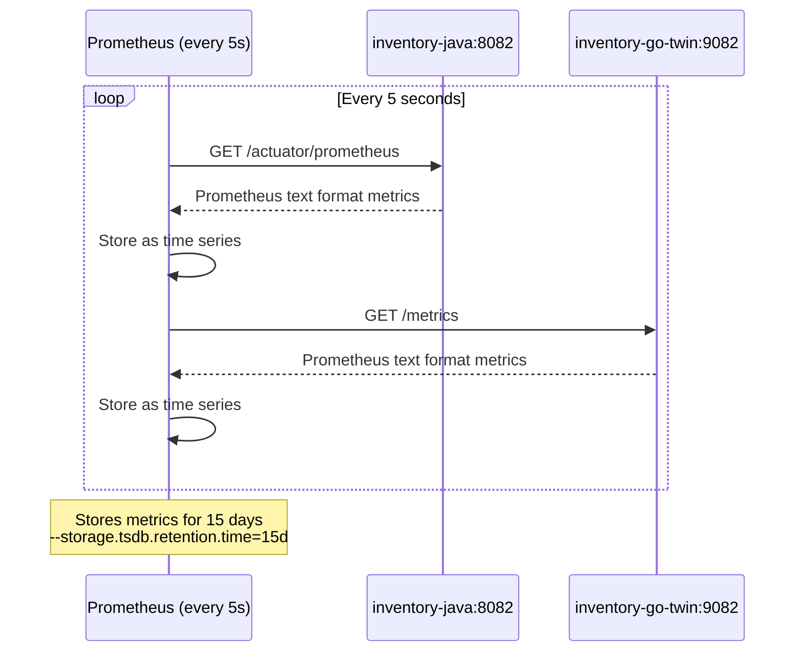

# 12 — Prometheus and Grafana


### Time-Series Correlation

A key finding from this dashboard is the **time-series correlation across the 6 phases (Warmup, Ramp 1-3, Sustain, Cooldown)**:
- **Phase 1 (Warmup):** We see Panel 2 (CPU) spike massively for Java due to HotSpot JIT compilation, while Panel 4 (Throughput) remains low.
- **Phase 4 (Ramp 3):** Panel 7 (DB Connections) shows HikariCP pending connections start to queue. Exactly at this same timestamp, Panel 3 (P99 Latency) spikes to 14.5s.
- **Phase 5 (Sustain):** Panel 6 (GC Pauses) shows Java's G1GC pause rate hitting 98.8 ms/s. Simultaneously, Panel 9 (Error Rate) shows 8 HTTP 500 errors occurring due to Tomcat threads waiting >30s for the saturated HikariCP pool.
- **Phase 6 (Cooldown):** Panel 8 (Concurrency) shows Go goroutines immediately shrink from 766 back to ~60, while Java Tomcat threads persist.

---

## Prometheus Configuration

**File:** `observability/prometheus/prometheus.yml`

```yaml
global:
  scrape_interval: 5s      # How often Prometheus pulls metrics from targets
  evaluation_interval: 5s  # How often alerting rules are evaluated

scrape_configs:
  - job_name: 'spring-boot-services'
    metrics_path: '/actuator/prometheus'     # Micrometer Actuator endpoint
    static_configs:
      - targets:
          - 'inventory-java:8082'
          - 'order-java:8083'
          - 'warehouse-java-twin:9084'

  - job_name: 'go-services'
    metrics_path: '/metrics'                 # Standard Prometheus text format endpoint
    static_configs:
      - targets:
          - 'inventory-go-twin:9082'
          - 'order-go-twin:9083'
          - 'warehouse-go:8084'
```

### Scrape Process Flow



### Java Metrics Path — `/actuator/prometheus`

Spring Boot Actuator exposes metrics via the `/actuator/prometheus` endpoint. This requires:

1. `spring-boot-starter-actuator` in pom.xml
2. `micrometer-registry-prometheus` in pom.xml
3. By default, the actuator endpoint is enabled and accessible

**Sample Prometheus text output (Spring):**

```text
# HELP http_server_requests_seconds Duration of HTTP server request handling
# TYPE http_server_requests_seconds summary
http_server_requests_seconds_count{exception="None",method="POST",outcome="SUCCESS",status="201",uri="/orders"} 64549
http_server_requests_seconds_sum{...} 163407.5
http_server_requests_seconds_max{...} 15.289

# HELP jvm_memory_used_bytes
# TYPE jvm_memory_used_bytes gauge
jvm_memory_used_bytes{area="heap",id="G1 Old Gen"} 150000000
jvm_memory_used_bytes{area="heap",id="G1 Eden Space"} 45000000
jvm_memory_used_bytes{area="nonheap",id="Metaspace"} 75000000

# HELP hikaricp_connections_active
# TYPE hikaricp_connections_active gauge
hikaricp_connections_active{pool="HikariPool-1"} 12

# HELP jvm_threads_live_threads
# TYPE jvm_threads_live_threads gauge
jvm_threads_live_threads 42
```

### Go Metrics Path — `/metrics`

Go services expose the standard Prometheus format via `go-gin-prometheus`:

**Sample output (Go):**

```text
# HELP gin_request_duration_seconds The HTTP request latencies in seconds
# TYPE gin_request_duration_seconds histogram
gin_request_duration_seconds_bucket{code="201",handler="CreateOrder",method="POST",le="0.005"} 0
gin_request_duration_seconds_bucket{code="201",...,le="10.0"} 59070
gin_request_duration_seconds_sum{code="201",...} 168745.3
gin_request_duration_seconds_count{code="201",...} 59070

# HELP go_goroutines Number of goroutines that currently exist
# TYPE go_goroutines gauge
go_goroutines 28

# HELP go_memstats_heap_alloc_bytes Number of heap bytes allocated and still in use
# TYPE go_memstats_heap_alloc_bytes gauge
go_memstats_heap_alloc_bytes 4500000

# HELP process_resident_memory_bytes Resident memory size in bytes
# TYPE process_resident_memory_bytes gauge
process_resident_memory_bytes 45000000

# HELP go_sql_open_connections The number of established connections both in use and idle
# TYPE go_sql_open_connections gauge
go_sql_open_connections{db="order_db"} 15
go_sql_in_use_connections{db="order_db"} 8
go_sql_idle_connections{db="order_db"} 7
```

---

## Grafana Dashboard — 9 Panels

**Setup:**

```yaml
# docker-compose.ssp.yml
grafana:
  image: grafana/grafana:latest
  environment:
    - GF_SECURITY_ADMIN_PASSWORD=admin
  volumes:
    - ./observability/grafana/provisioning:/etc/grafana/provisioning
  # Provisioning auto-loads datasources and dashboards
```

---

### Panel 1 — RSS Memory Footprint

**What it measures:** Total process memory usage as seen by the OS.

**PromQL:**

```promql
# Go (RSS):
process_resident_memory_bytes

# Java (JVM total memory used, best equivalent):
sum(jvm_memory_used_bytes) by (instance)
```

**Why Spring Boot doesn't emit `process_resident_memory_bytes`:**
Micrometer does NOT export this metric for Spring Boot. The `process_resident_memory_bytes` metric is a standard Go Prometheus client metric. For Java, the best equivalent is `sum(jvm_memory_used_bytes)` — total JVM committed memory (heap + non-heap: metaspace, code cache, etc.).

**How to Read:**

- **Y-axis:** Memory in bytes
- **X-axis:** Time
- **Expected Go pattern:** Low, flat baseline with minor oscillation (GC cycles)
- **Expected Java pattern:** Sawtooth wave — gradual heap growth → GC collection → drop → repeat

**Interview Point:** The sawtooth is not a memory leak — it's the JVM's garbage collector working as designed. Eden space fills up, minor GC runs, survivors promoted, major GC eventually runs.

---

### Panel 2 — CPU Usage Rate

**What it measures:** CPU utilization rate.

**PromQL:**

```promql
# Spring Boot (Micrometer):
process_cpu_usage                    # Direct gauge: 0.0 to 1.0 (fraction of CPU)

# Go:
rate(process_cpu_seconds_total[1m])  # Rate of CPU seconds consumed per second
```

**Interpretation:**

- `process_cpu_usage = 0.5` → Service is using 50% of its CPU allotment
- `rate(process_cpu_seconds_total[1m]) = 0.5` → Same interpretation
- With 1 CPU limit, `1.0` = 100% CPU saturation → bottleneck

---

### Panel 3 — P99 HTTP Latency

**What it measures:** The 99th percentile HTTP request duration.

**PromQL:**

```promql
# Java (Spring Actuator):
histogram_quantile(0.99,
  sum(rate(http_server_requests_seconds_bucket[1m])) by (le, instance)
)

# Go (Gin):
histogram_quantile(0.99,
  sum(rate(gin_request_duration_seconds_bucket[1m])) by (le, instance)
)
```

**How `histogram_quantile` works:**

- `http_server_requests_seconds_bucket` is a counter with a label `le` (less than or equal to)
- Each bucket counts requests completing within that duration
- `rate(...[1m])` converts cumulative counters to per-second rates
- `histogram_quantile(0.99, ...)` estimates the 99th percentile from the bucket distribution

**Why `by (le, instance)`:**

- `le` MUST be included — it's the bucket boundary label
- `instance` separates different services (inventory-java vs order-java)

---

### Panel 4 — HTTP Throughput

**What it measures:** Requests handled per second.

**PromQL:**

```promql
# Java:
sum(rate(http_server_requests_seconds_count[1m])) by (instance)

# Go:
sum(rate(gin_request_duration_seconds_count[1m])) by (instance)
```

**Interpretation:**

- `rate()` computes the per-second rate of the counter over a 1-minute window
- Higher = more throughput
- Under 200 VUs with `sleep(1)`, theoretical max throughput ≈ 200 RPS (if all respond instantly)
- Actual throughput limited by processing time + DB I/O

---

### Panel 5 — Resource Footprint (Memory Churn / Heap)

**What it measures:** Heap memory allocated vs collected (GC-visible churn).

**PromQL:**

```promql
# Java (JVM heap only, excluding metaspace):
jvm_memory_used_bytes{area="heap"}

# Go (heap allocations currently in use):
go_memstats_heap_alloc_bytes
```

**Why Separate from Panel 1:**
Panel 1 shows total OS memory (RSS). Panel 5 shows heap-specific memory, which is directly affected by GC. The difference reveals JVM overhead (metaspace, JIT compiled code, native memory).

---

### Panel 6 — Garbage Collection Pauses

**What it measures:** Time spent in GC pause activity.

**PromQL:**

```promql
# Java GC pause rate (seconds of GC pause per second of time):
rate(jvm_gc_pause_seconds_sum[1m])

# Go GC pause rate (same concept):
rate(go_gc_duration_seconds_sum[1m])

# Go GC cycle frequency (cycles per second):
rate(go_gc_duration_seconds_count[1m])
```

**`jvm_gc_pause_seconds_sum` vs `go_gc_duration_seconds_sum`:**

- Java: Includes stop-the-world pause time for G1GC (minor + major collections)
- Go: Includes concurrent GC time (most of Go's GC is non-stop-the-world)
- Go's metric captures time from GC start to end, even if application ran during most of it

**Interview Point:** This is a crucial comparison point. JVM G1GC typically shows lower GC frequency but longer individual pauses. Go's tri-color concurrent GC shows higher frequency but shorter (often sub-millisecond) pauses.

---

### Panel 7 — DB Connection Pool

**What it measures:** Connection pool utilization.

**PromQL:**

```promql
# Java HikariCP active connections:
hikaricp_connections_active         # RefA

# Java HikariCP pending (waiting for connection):
hikaricp_connections_pending        # RefB

# Go sql.DB in-use connections (≈ HikariCP active):
go_sql_in_use_connections           # RefC

# Go total open connections:
go_sql_open_connections             # RefD

# Go idle connections:
go_sql_idle_connections             # RefE
```

**Interpretation:**

- `hikaricp_connections_active` → Connections currently executing a DB query
- `hikaricp_connections_pending` → Threads waiting for a connection (CRITICAL: indicates pool saturation)
- If `pending > 0` consistently → pool size is too small for the load

---

### Panel 8 — Concurrency Model (Threads vs Goroutines)

**What it measures:** Concurrent execution units.

**PromQL:**

```promql
# Java JVM live threads:
jvm_threads_live_threads

# Go goroutines:
go_goroutines
```

**Expected Values:**

- Java under 200 VUs: ~210-250 threads (Tomcat pool + background JVM threads)
- Go under 200 VUs: ~20-50 goroutines (Gin's minimal overhead, goroutines are created and destroyed efficiently)

**Why Java needs more threads:**

- Tomcat: 1 thread per active HTTP connection
- Spring: Background threads for Spring scheduling, JVM GC threads, Feign connection management
- JVM: GC threads, JIT compiler threads, finalizer thread

**Why Go needs fewer goroutines:**

- Gin spawns goroutines per connection but they complete and return quickly
- Go scheduler efficiently multiplexes many goroutines on few threads
- No background Spring framework overhead

---

### Panel 9 — HTTP Error Rate

**What it measures:** 5xx error rate per second.

**PromQL:**

```promql
# Java (status label):
sum(rate(http_server_requests_seconds_count{status=~"5.*"}[1m])) by (instance)

# Go (code label — Gin uses 'code' not 'status'):
sum(rate(gin_request_duration_seconds_count{code=~"5.*"}[1m])) by (instance)
```

**Critical Label Difference:**

- Spring Actuator labels: `status` (HTTP status code)
- Gin Prometheus labels: `code` (HTTP status code)
- This was a bug found during setup: querying `{status=~"5.*"}` against Go metrics returns nothing!

---

## PromQL Concepts for Interviews

| PromQL Function | What It Does | When to Use |
| ---------------- | ------------- | ------------- |
| `rate(metric[1m])` | Per-second rate of increase of a counter over 1 min window | Converting counters to rates |
| `sum(...) by (label)` | Aggregates across all series, keeping specified labels | Combining instances |
| `histogram_quantile(0.99, ...)` | Computes 99th percentile from histogram buckets | Latency percentiles |
| `irate(metric[5m])` | Instantaneous rate (last 2 samples) | Very recent spikes |
| `avg_over_time(gauge[5m])` | Time-averaged gauge value | Smoothing noisy gauges |

---

## Prometheus Data Model

Every metric has:

- **Metric name:** `http_server_requests_seconds_count`
- **Labels (dimensions):** `{instance="order-java:8083", method="POST", status="201"}`
- **Timestamp:** Unix epoch (milliseconds)
- **Value:** float64

**Cardinality Warning:**
High-cardinality labels (like `user_id` in the label set) would create millions of time series. Labels should have bounded cardinality (HTTP methods, status codes, instance names — all bounded).

---

## Interview Questions — Prometheus & Grafana

1. **What is a Prometheus scrape?**
   → Prometheus pulls metrics from the target's HTTP endpoint every `scrape_interval` seconds. It's a pull model — services don't push metrics.

2. **What is a histogram in Prometheus?**
   → A metric type that samples observations and counts them in configurable buckets. Enables percentile computation via `histogram_quantile()`. Unlike summaries, histograms are aggregatable across instances.

3. **Why does `histogram_quantile()` need the `le` label?**
   → `le` = "less than or equal to" — the bucket boundary. Without preserving this label in the aggregation, the bucket structure is lost and quantile computation fails.

4. **What is the difference between `rate()` and `irate()`?**
   → `rate()` averages the rate over the entire time window (smoother, good for dashboards). `irate()` uses only the last 2 data points (more sensitive to spikes, good for alerting).

5. **Why does Java use `/actuator/prometheus` while Go uses `/metrics`?**
   → Spring Boot Actuator exposes management endpoints under `/actuator/`. Prometheus client libraries for Go use `/metrics` by convention. Both serve Prometheus text format.

6. **What is metric cardinality?**

```mermaid
