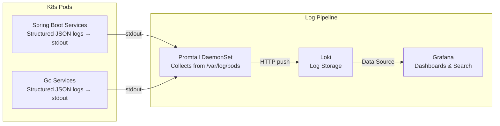

# LPG Stack Integration Plan
## Smart Order Fulfillment System

### Overview
This project uses the lightweight LPG stack (Loki, Promtail, Grafana) for log aggregation and visualization to minimize resource usage in local environments like Minikube. Every pod's stdout/stderr logs will be collected by a Promtail DaemonSet, shipped to Loki, and visualized in Grafana.



---

## Deployment Configuration

The LPG stack components are configured as follows:

1.  **Grafana (`k8s/lpg/grafana.yaml`)**:
    *   Deployment and Service on port 3000.
    *   Minimal resource requests (128Mi) and limits (256Mi).

2.  **Loki (`k8s/lpg/loki.yaml`)**:
    *   Single-instance Deployment and Service on port 3100.
    *   ConfigMap uses `boltdb-shipper` and ephemeral filesystem storage (`/tmp/loki`).
    *   Minimal resource requests (128Mi) and limits (256Mi).

3.  **Promtail (`k8s/lpg/promtail.yaml`)**:
    *   DaemonSet (one per node).
    *   ConfigMap sets Loki push URL `http://loki:3100/loki/api/v1/push`.
    *   ServiceAccount, ClusterRole, and ClusterRoleBinding setup to allow pod/node inspection for metadata enrichment.

---

## Deployment Order

If you are deploying LPG manually, follow these steps:

```bash
# 1. Deploy Loki (Needs to be ready to receive logs)
kubectl apply -f k8s/lpg/loki.yaml -n smart-order

# 2. Deploy Promtail (Begins scraping and sending to Loki)
kubectl apply -f k8s/lpg/promtail.yaml -n smart-order

# 3. Deploy Grafana (Used for querying Loki)
kubectl apply -f k8s/lpg/grafana.yaml -n smart-order
```

---

## Accessing Grafana

1.  Port-forward the Grafana service:
    ```bash
    kubectl port-forward svc/grafana 3000:3000 -n smart-order
    ```
2.  Open `http://localhost:3000` in your browser.
3.  Add a new Data Source in Grafana:
    *   Type: Loki
    *   URL: `http://loki:3100`
4.  You can now start querying your application logs using LogQL!

---

## Resource Requirements

| Component | CPU Request | Memory Request | Notes |
|-----------|-------------|----------------|-------|
| Loki | - | 128Mi | Ephemeral config |
| Grafana | - | 128Mi | |
| Promtail (per node) | - | 64Mi | DaemonSet — 1 per node |
| **Total added** | **Minimal** | **~320Mi** | Extremely lightweight compared to ELK |

> [!TIP]
> The LPG stack is significantly more efficient than the ELK stack and is recommended for constrained environments.
